# AIRIS Microservices — Database Architecture

**Source of truth:** `backend/alembic/versions/0001_initial.py` (revision `0001_initial`, no parent revision) cross-checked against `backend/app/models/*.py`. This is the *only* migration in the repository — the historical 143-revision monolith chain has been superseded and deleted. Anything not present in these two sources is explicitly marked "not determinable" rather than guessed.

Target engine: PostgreSQL (Supabase). Extensions enabled: `pgcrypto` (for `gen_random_uuid()`) and `pg_trgm` (fuzzy/trigram search).

---

## STEP 1 — Database Analysis Summary

- **10 PostgreSQL schemas**, one per bounded context / microservice: `identity`, `candidate`, `jobs`, `pipeline`, `screening`, `interview`, `proctoring`, `communication`, `ai`, `analytics`.
- **76 tables** total (see per-schema breakdown below).
- **7 native PostgreSQL enum types**, each created inside its owning schema.
- **Primary keys:** every table uses a `UUID DEFAULT gen_random_uuid()` surrogate key, except `ai.ai_rate_limit_log` which uses `BIGSERIAL`, and `jobs.job_vendors` which uses a composite PK `(job_id, vendor_id)`.
- **Real (enforced) foreign keys** exist only **within** a schema (intra-service), with one deliberate exception: a 3-column composite FK pattern inside `candidate` used for tenant-scoping (see below).
- **Cross-schema relationships** are implemented as plain indexed UUID columns with **no** database-level FK constraint. The migration documents each one in a source comment directly above the `CREATE TABLE` statement (e.g. `# [job_submissions] cross-service reference IDs (no FK — integrity at service layer): submitted_by -> identity.profiles.id`).
- **No SQLAlchemy `relationship()` mappings exist anywhere in `app/models/`.** Every model is a flat table definition (columns + `ForeignKey()` + indexes only). Cross-model navigation, joins, and referential integrity are handled entirely in service-layer Python code, not the ORM or the database.
- `app/models/__init__.py` does not even export the model classes — it only exports a schema-agnostic reflection helper (`reflect_database_schema`). Each service module imports the specific model files it needs directly.

---

## 1. Schema Overview

| Schema | Tables | Purpose | Owning Service |
|---|---|---|---|
| `identity` | 12 | Organizations, workspaces, users/profiles, RBAC (roles & permissions), auth sessions, MFA, email verification, security audit logging | **Identity Service** |
| `candidate` | 10 | Candidate profiles, resumes/parsing, skills, bulk upload pipeline, sourcing sessions/results, candidate-job match scoring, placement history, audit trail | **Candidate Service** |
| `jobs` | 9 | Clients (customers), job requisitions, job skills, vendor assignment, client portal access, submission tracking, status history, match caching | **Job Service** |
| `pipeline` | 6 | Applications, recruiting pipeline stage/status machine, offers and offer events, full stage/status history | **Pipeline Service** |
| `screening` | 7 | AI-driven candidate screening interviews (async/live), question generation, transcripts, per-question evaluation, reminders | **AI Screening Service** |
| `interview` | 16 | Human interview scheduling, interviewer profiles/availability/skills, booking links/slots, feedback, notes, participants, reminders, reschedule history, AI copilot (live suggestions + transcripts), voice profiles, candidate invites | **Interview Service** |
| `proctoring` | 4 | Exam/interview integrity monitoring: sessions, behavioral events, computed risk/trust scores, evidence capture | **Proctoring Service** |
| `communication` | 5 | Multi-channel (email/etc.) messaging: provider connections, templates, sent messages, scheduled reminders, delivery events | **Communication Service** |
| `ai` | 6 | Cross-cutting AI cost governance: request logging, model pricing master data, rate-limit logging, cost alerts, log retention config/cleanup audit | **AI Governance Service** |
| `analytics` | 1 | Cross-cutting HTTP request/audit logging for observability | **Analytics / Platform Service** |

**Total: 76 tables across 10 schemas.**

---

## 2. Database ER Diagram

Diagrams are split by schema group for readability; a full cross-schema reference map follows in Section 4. Only columns relevant to keys/relationships/typing are shown — see the migration for full column lists.

### 2.1 `identity` schema

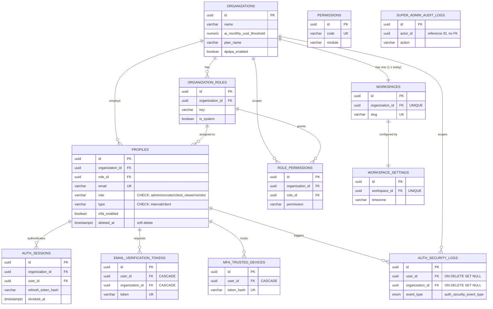

`identity.super_admin_audit_logs` is standalone (platform-level, cross-org by design — `actor_id` is a reference ID, not scoped to one organization).

### 2.2 `candidate` schema

```mermaid
erDiagram
    CANDIDATES ||--o{ CANDIDATES : "merged_into_id (self-FK, SET NULL)"
    CANDIDATES ||--o{ CANDIDATE_AUDIT_LOGS : "audited by (composite FK)"
    CANDIDATES ||--o{ CANDIDATE_INTERACTIONS : "logged via (composite FK)"
    CANDIDATES ||--o{ CANDIDATE_SKILLS : "has (composite FK)"
    CANDIDATES ||--o{ CANDIDATE_PLACEMENT_HISTORY : "has"
    CANDIDATES ||--o{ SOURCING_RESULTS : "imported as (SET NULL)"
    SOURCING_SESSIONS ||--o{ SOURCING_RESULTS : "produces (CASCADE)"
    BULK_UPLOAD_JOBS ||--o{ BULK_UPLOAD_ITEMS : "contains (CASCADE)"

    CANDIDATES {
        uuid id PK
        uuid org_id
        uuid workspace_id
        varchar email
        varchar stage
        uuid merged_into_id FK "self, SET NULL"
        uuid merged_into_candidate_id "legacy duplicate column, no FK"
        boolean is_merged
        enum source_type "candidate_source_type"
        jsonb parsed_resume_data
        uuid created_by "ref -> identity.profiles.id"
    }
    CANDIDATE_JOB_MATCHES {
        uuid id PK
        uuid candidate_id "no FK"
        uuid job_id "ref -> jobs.jobs.id, no FK"
        integer match_score
        varchar recommendation
        varchar ats_pipeline_status
    }
    CANDIDATE_PLACEMENT_HISTORY {
        uuid id PK
        uuid candidate_id FK "CASCADE"
        uuid job_id "ref -> jobs.jobs.id, no FK"
        varchar outcome "CHECK enum-like"
    }
    CANDIDATE_SKILLS {
        uuid id PK
        uuid candidate_id FK "composite (id, org_id, workspace_id)"
        varchar normalized_name
    }
    CANDIDATE_AUDIT_LOGS {
        uuid id PK
        uuid candidate_id FK "composite tenant FK, CASCADE"
    }
    CANDIDATE_INTERACTIONS {
        uuid id PK
        uuid candidate_id FK "composite tenant FK, CASCADE"
    }
    SOURCING_SESSIONS {
        uuid id PK
        uuid organization_id "ref -> identity.organizations.id"
        uuid job_id "no FK"
        enum status "sourcing_session_status"
    }
    SOURCING_RESULTS {
        uuid id PK
        uuid session_id FK "CASCADE"
        uuid candidate_id FK "SET NULL"
        enum action "sourcing_result_action"
    }
    BULK_UPLOAD_JOBS {
        uuid id PK
        uuid org_id
        uuid workspace_id
        varchar status
    }
    BULK_UPLOAD_ITEMS {
        uuid id PK
        uuid job_id FK "CASCADE"
        uuid candidate_id "no FK"
    }
```

**Composite tenant FK pattern:** `candidate.candidates` carries `CONSTRAINT uq_candidates_id_org_workspace UNIQUE (id, org_id, workspace_id)`. Three child tables (`candidate_audit_logs`, `candidate_interactions`, `candidate_skills`) declare a 3-column composite foreign key `(candidate_id, org_id, workspace_id) REFERENCES candidates(id, org_id, workspace_id)`. This is the only place in the schema where tenant isolation is enforced at the database level via the FK itself, rather than left to application-layer filtering.

### 2.3 `jobs` schema

```mermaid
erDiagram
    CLIENTS ||--o{ CLIENT_RECRUITER_ASSIGNMENTS : "assigns (CASCADE)"
    CLIENTS ||--o{ JOBS : "requests (2x duplicate FK)"
    JOBS ||--o{ CLIENT_JOB_ACCESS : "grants access to (CASCADE-ish)"
    JOBS ||--|| JOB_MATCH_CACHE : "caches (CASCADE, UNIQUE job_id)"
    JOBS ||--o{ JOB_SKILLS : "requires (CASCADE)"
    JOBS ||--o{ JOB_STATUS_HISTORY : "logs (CASCADE)"
    JOBS ||--o{ JOB_SUBMISSIONS : "receives (CASCADE)"
    JOBS ||--o{ JOB_VENDORS : "assigned to (CASCADE)"

    CLIENTS {
        uuid id PK
        uuid organization_id
        varchar name UK "per org"
        varchar email UK "per org"
    }
    JOBS {
        uuid id PK
        uuid organization_id
        uuid client_id FK "duplicate constraint x2"
        varchar status "CHECK: draft/open/paused/closed/filled"
        uuid created_by "ref -> identity.profiles.id"
        numeric salary_min "CHECK <= salary_max"
        numeric salary_max
    }
    CLIENT_RECRUITER_ASSIGNMENTS {
        uuid id PK
        uuid client_id FK "CASCADE"
        uuid recruiter_id "ref -> identity.profiles.id"
    }
    CLIENT_JOB_ACCESS {
        uuid id PK
        uuid job_id FK
        uuid user_id "ref -> identity.profiles.id"
    }
    JOB_MATCH_CACHE {
        uuid id PK
        uuid job_id FK "UNIQUE, CASCADE"
        jsonb ranked_candidate_ids
    }
    JOB_SKILLS {
        uuid id PK
        uuid job_id FK "CASCADE"
        varchar skill
    }
    JOB_STATUS_HISTORY {
        uuid id PK
        uuid job_id FK "CASCADE"
        varchar previous_status
        varchar new_status
    }
    JOB_SUBMISSIONS {
        uuid id PK
        uuid job_id FK "CASCADE"
        uuid candidate_id "ref -> candidate.candidates.id"
        uuid submitted_by "ref -> identity.profiles.id"
        uuid vendor_id "ref -> identity.profiles.id"
    }
    JOB_VENDORS {
        uuid job_id PK-FK "composite PK, CASCADE"
        uuid vendor_id PK "ref -> identity.profiles.id"
    }
```

### 2.4 `pipeline` schema

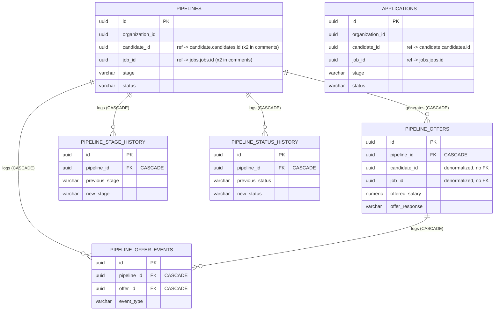

`pipeline.applications` and `pipeline.pipelines` are two structurally near-identical tables (both `UNIQUE(candidate_id, job_id)`, both denormalize `candidate_id`/`job_id` as reference IDs). The migration does not link them to each other with any FK — see Section 6, technical debt.

### 2.5 `screening` schema

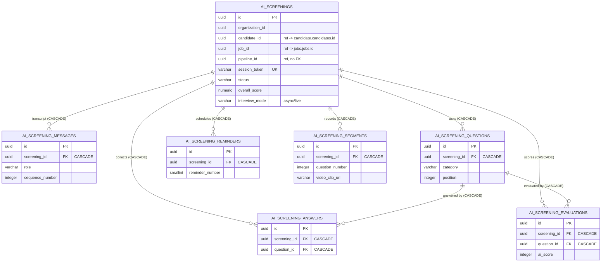

### 2.6 `interview` schema

```mermaid
erDiagram
    INTERVIEWER_PROFILES ||--o{ INTERVIEWER_AVAILABILITY : "sets (CASCADE)"
    INTERVIEWER_PROFILES ||--o{ INTERVIEWER_SKILLS : "has (CASCADE)"
    INTERVIEW_BOOKING_LINKS ||--o{ INTERVIEW_BOOKING_SLOTS : "offers (CASCADE)"
    INTERVIEWS ||--o| INTERVIEW_BOOKING_SLOTS : "fills (optional FK)"
    INTERVIEWS ||--|| INTERVIEW_COPILOT_SESSIONS : "runs (CASCADE, UNIQUE interview_id)"
    INTERVIEWS ||--o{ INTERVIEW_FEEDBACK : "receives (CASCADE)"
    INTERVIEWS ||--o{ INTERVIEW_NOTES : "documented by (CASCADE)"
    INTERVIEWS ||--o{ INTERVIEW_PARTICIPANTS : "includes (CASCADE)"
    INTERVIEWS ||--o{ INTERVIEW_REMINDERS : "schedules (CASCADE)"
    INTERVIEWS ||--o{ INTERVIEW_RESCHEDULE_HISTORY : "logs (CASCADE)"
    INTERVIEW_COPILOT_SESSIONS ||--o{ INTERVIEW_AI_SUGGESTIONS : "suggests (CASCADE)"
    INTERVIEWS ||--o{ INTERVIEW_AI_SUGGESTIONS : "targets (CASCADE)"
    INTERVIEW_COPILOT_SESSIONS ||--o{ INTERVIEW_TRANSCRIPT_SEGMENTS : "captures (CASCADE)"
    INTERVIEWS ||--o{ INTERVIEW_TRANSCRIPT_SEGMENTS : "belongs to (CASCADE)"

    INTERVIEWS {
        uuid id PK
        uuid organization_id
        uuid pipeline_id "ref -> pipeline.pipelines.id, no FK"
        uuid candidate_id "ref -> candidate.candidates.id, no FK"
        uuid job_id "ref -> jobs.jobs.id, no FK"
        timestamptz scheduled_at
        varchar status
        jsonb ai_summary
    }
    INTERVIEW_BOOKING_LINKS {
        uuid id PK
        uuid organization_id "ref -> identity.organizations.id"
        uuid recruiter_id "ref -> identity.profiles.id"
        uuid candidate_id "ref -> candidate.candidates.id"
        uuid job_id "ref -> jobs.jobs.id"
        uuid pipeline_id "ref -> pipeline.pipelines.id"
        uuid token UK
    }
    INTERVIEW_BOOKING_SLOTS {
        uuid id PK
        uuid booking_link_id FK "CASCADE"
        uuid interview_id FK "no cascade rule"
        boolean is_booked
    }
    INTERVIEW_VOICE_PROFILES {
        uuid id PK
        uuid screening_id "ref -> screening.ai_screenings.id, UNIQUE, no FK"
        jsonb embedding
    }
    INVITES {
        uuid id PK
        varchar email
        uuid organization_id "ref -> identity.organizations.id"
        varchar token UK
        varchar status "CHECK: sent/opened/accepted/expired"
    }
    INTERVIEWER_PROFILES {
        uuid id PK
        uuid organization_id
        uuid user_id "ref -> identity.profiles.id"
    }
    INTERVIEWER_AVAILABILITY {
        uuid id PK
        uuid interviewer_profile_id FK "CASCADE"
        integer day_of_week
    }
    INTERVIEWER_SKILLS {
        uuid id PK
        uuid interviewer_profile_id FK "CASCADE"
    }
    INTERVIEW_COPILOT_SESSIONS {
        uuid id PK
        uuid organization_id
        uuid interview_id FK "CASCADE, UNIQUE"
    }
    INTERVIEW_AI_SUGGESTIONS {
        uuid id PK
        uuid session_id FK "CASCADE"
        uuid interview_id FK "CASCADE"
    }
    INTERVIEW_TRANSCRIPT_SEGMENTS {
        uuid id PK
        uuid session_id FK "CASCADE"
        uuid interview_id FK "CASCADE"
    }
    INTERVIEW_FEEDBACK {
        uuid id PK
        uuid interview_id FK "CASCADE"
        uuid reviewer_id "ref -> identity.profiles.id"
        integer rating
    }
    INTERVIEW_NOTES {
        uuid id PK
        uuid interview_id FK "CASCADE"
        uuid interviewer_id "ref -> identity.profiles.id"
    }
    INTERVIEW_PARTICIPANTS {
        uuid id PK
        uuid interview_id FK "CASCADE"
        uuid user_id "ref -> identity.profiles.id"
    }
    INTERVIEW_REMINDERS {
        uuid id PK
        uuid interview_id FK "CASCADE"
    }
    INTERVIEW_RESCHEDULE_HISTORY {
        uuid id PK
        uuid interview_id FK "CASCADE"
        uuid changed_by "ref -> identity.profiles.id"
    }
```

### 2.7 `proctoring` schema

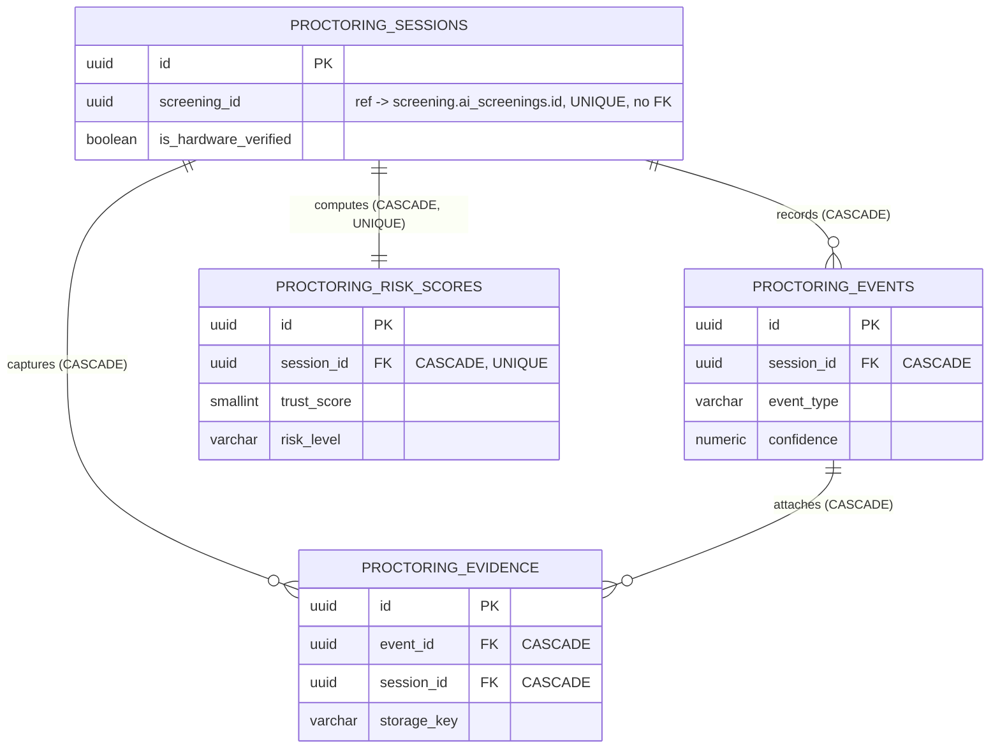

### 2.8 `communication` schema

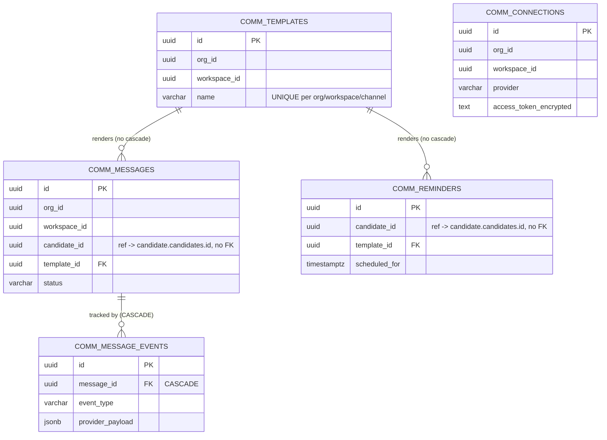

### 2.9 `ai` schema

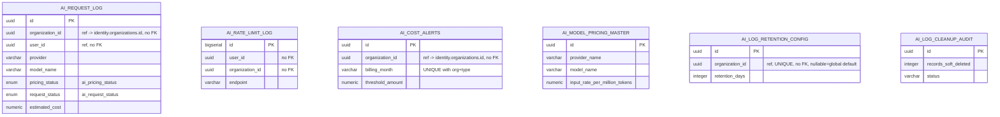

No table in `ai` has a database FK — it is entirely standalone/cross-cutting, correlating to other schemas only via reference UUIDs.

### 2.10 `analytics` schema

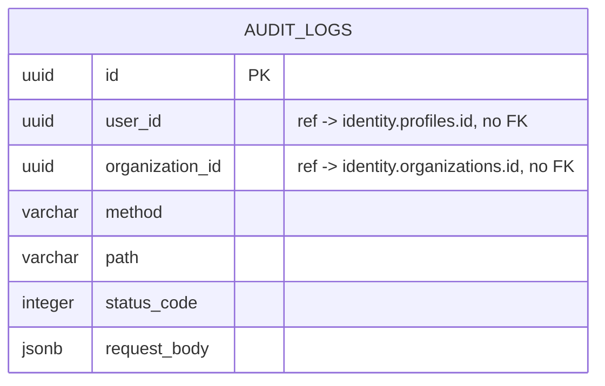

Single standalone table — an HTTP-request audit trail with no FKs at all, by design (it must survive even if the referenced org/user record is later deleted).

### 2.11 Complete Database Architecture — single consolidated diagram

All 10 schemas, all 76 tables, in one view. Solid arrows are real, Postgres-enforced foreign keys (always intra-schema). Dashed arrows are the documented cross-schema reference IDs from Section 4.2 (no DB constraint). Color = owning schema.

```mermaid
flowchart TB
    classDef identity fill:#e3f2fd,stroke:#1565c0,color:#0d47a1
    classDef candidate fill:#e8f5e9,stroke:#2e7d32,color:#1b5e20
    classDef jobs fill:#fff3e0,stroke:#ef6c00,color:#e65100
    classDef pipeline fill:#f3e5f5,stroke:#6a1b9a,color:#4a148c
    classDef screening fill:#fce4ec,stroke:#ad1457,color:#880e4f
    classDef interview fill:#e0f7fa,stroke:#00838f,color:#006064
    classDef proctoring fill:#fff8e1,stroke:#f9a825,color:#f57f17
    classDef communication fill:#ede7f6,stroke:#4527a0,color:#311b92
    classDef ai fill:#f1f8e9,stroke:#558b2f,color:#33691e
    classDef analytics fill:#eceff1,stroke:#455a64,color:#263238

    subgraph SCH_ID["identity — 12 tables"]
        id_org["organizations"]:::identity
        id_perm["permissions"]:::identity
        id_saal["super_admin_audit_logs"]:::identity
        id_orgroles["organization_roles"]:::identity
        id_ws["workspaces"]:::identity
        id_prof["profiles"]:::identity
        id_rp["role_permissions"]:::identity
        id_wss["workspace_settings"]:::identity
        id_asl["auth_security_logs"]:::identity
        id_as["auth_sessions"]:::identity
        id_evt["email_verification_tokens"]:::identity
        id_mfa["mfa_trusted_devices"]:::identity
    end

    subgraph SCH_CD["candidate — 10 tables"]
        cd_buj["bulk_upload_jobs"]:::candidate
        cd_bui["bulk_upload_items"]:::candidate
        cd_cand["candidates"]:::candidate
        cd_ss["sourcing_sessions"]:::candidate
        cd_cal["candidate_audit_logs"]:::candidate
        cd_ci["candidate_interactions"]:::candidate
        cd_cjm["candidate_job_matches"]:::candidate
        cd_cph["candidate_placement_history"]:::candidate
        cd_cs["candidate_skills"]:::candidate
        cd_sr["sourcing_results"]:::candidate
    end

    subgraph SCH_JB["jobs — 9 tables"]
        jb_cl["clients"]:::jobs
        jb_cra["client_recruiter_assignments"]:::jobs
        jb_jobs["jobs"]:::jobs
        jb_cja["client_job_access"]:::jobs
        jb_jmc["job_match_cache"]:::jobs
        jb_js["job_skills"]:::jobs
        jb_jsh["job_status_history"]:::jobs
        jb_sub["job_submissions"]:::jobs
        jb_jv["job_vendors"]:::jobs
    end

    subgraph SCH_PL["pipeline — 6 tables"]
        pl_app["applications"]:::pipeline
        pl_pipe["pipelines"]:::pipeline
        pl_off["pipeline_offers"]:::pipeline
        pl_sh["pipeline_stage_history"]:::pipeline
        pl_sth["pipeline_status_history"]:::pipeline
        pl_oe["pipeline_offer_events"]:::pipeline
    end

    subgraph SCH_SC["screening — 7 tables"]
        sc_scr["ai_screenings"]:::screening
        sc_msg["ai_screening_messages"]:::screening
        sc_q["ai_screening_questions"]:::screening
        sc_rem["ai_screening_reminders"]:::screening
        sc_seg["ai_screening_segments"]:::screening
        sc_ans["ai_screening_answers"]:::screening
        sc_ev["ai_screening_evaluations"]:::screening
    end

    subgraph SCH_IV["interview — 16 tables"]
        iv_ip["interviewer_profiles"]:::interview
        iv_av["interviewer_availability"]:::interview
        iv_isk["interviewer_skills"]:::interview
        iv_inv["invites"]:::interview
        iv_bl["interview_booking_links"]:::interview
        iv_vp["interview_voice_profiles"]:::interview
        iv_int["interviews"]:::interview
        iv_bs["interview_booking_slots"]:::interview
        iv_cs["interview_copilot_sessions"]:::interview
        iv_fb["interview_feedback"]:::interview
        iv_note["interview_notes"]:::interview
        iv_part["interview_participants"]:::interview
        iv_rmd["interview_reminders"]:::interview
        iv_rh["interview_reschedule_history"]:::interview
        iv_ais["interview_ai_suggestions"]:::interview
        iv_ts["interview_transcript_segments"]:::interview
    end

    subgraph SCH_PR["proctoring — 4 tables"]
        pr_sess["proctoring_sessions"]:::proctoring
        pr_evt["proctoring_events"]:::proctoring
        pr_rs["proctoring_risk_scores"]:::proctoring
        pr_evd["proctoring_evidence"]:::proctoring
    end

    subgraph SCH_CM["communication — 5 tables"]
        cm_conn["comm_connections"]:::communication
        cm_tmpl["comm_templates"]:::communication
        cm_msg["comm_messages"]:::communication
        cm_rmd["comm_reminders"]:::communication
        cm_me["comm_message_events"]:::communication
    end

    subgraph SCH_AI["ai — 6 tables"]
        ai_lca["ai_log_cleanup_audit"]:::ai
        ai_pm["ai_model_pricing_master"]:::ai
        ai_rll["ai_rate_limit_log"]:::ai
        ai_ca["ai_cost_alerts"]:::ai
        ai_lrc["ai_log_retention_config"]:::ai
        ai_rl["ai_request_log"]:::ai
    end

    subgraph SCH_AN["analytics — 1 table"]
        an_al["audit_logs"]:::analytics
    end

    %% ── identity: real FKs ──
    id_org --> id_orgroles
    id_org --> id_ws
    id_org --> id_prof
    id_org --> id_rp
    id_orgroles --> id_prof
    id_orgroles --> id_rp
    id_ws --> id_wss
    id_prof --> id_as
    id_prof --> id_evt
    id_prof --> id_mfa
    id_prof --> id_asl
    id_org --> id_asl
    id_org --> id_evt

    %% ── candidate: real FKs ──
    cd_buj --> cd_bui
    cd_cand -->|"merged_into_id, self"| cd_cand
    cd_cand -->|"composite tenant FK"| cd_cal
    cd_cand -->|"composite tenant FK"| cd_ci
    cd_cand -->|"composite tenant FK"| cd_cs
    cd_cand --> cd_cph
    cd_cand --> cd_sr
    cd_ss --> cd_sr

    %% ── jobs: real FKs ──
    jb_cl --> jb_cra
    jb_cl --> jb_jobs
    jb_jobs --> jb_cja
    jb_jobs --> jb_jmc
    jb_jobs --> jb_js
    jb_jobs --> jb_jsh
    jb_jobs --> jb_sub
    jb_jobs --> jb_jv

    %% ── pipeline: real FKs ──
    pl_pipe --> pl_off
    pl_pipe --> pl_sh
    pl_pipe --> pl_sth
    pl_pipe --> pl_oe
    pl_off --> pl_oe

    %% ── screening: real FKs ──
    sc_scr --> sc_msg
    sc_scr --> sc_q
    sc_scr --> sc_rem
    sc_scr --> sc_seg
    sc_scr --> sc_ans
    sc_scr --> sc_ev
    sc_q --> sc_ans
    sc_q --> sc_ev

    %% ── interview: real FKs ──
    iv_ip --> iv_av
    iv_ip --> iv_isk
    iv_bl --> iv_bs
    iv_int --> iv_bs
    iv_int --> iv_cs
    iv_int --> iv_fb
    iv_int --> iv_note
    iv_int --> iv_part
    iv_int --> iv_rmd
    iv_int --> iv_rh
    iv_cs --> iv_ais
    iv_int --> iv_ais
    iv_cs --> iv_ts
    iv_int --> iv_ts

    %% ── proctoring: real FKs ──
    pr_sess --> pr_evt
    pr_sess --> pr_rs
    pr_sess --> pr_evd
    pr_evt --> pr_evd

    %% ── communication: real FKs ──
    cm_tmpl --> cm_msg
    cm_tmpl --> cm_rmd
    cm_msg --> cm_me

    %% ── cross-schema reference IDs (no FK, dashed) ──
    cd_cand -.->|created_by| id_prof
    cd_ss -.->|organization_id| id_org
    cd_ss -.->|created_by| id_prof
    cd_cjm -.->|job_id| jb_jobs
    cd_cph -.->|job_id| jb_jobs
    jb_cra -.->|recruiter_id| id_prof
    jb_jobs -.->|created_by| id_prof
    jb_cja -.->|user_id| id_prof
    jb_sub -.->|"submitted_by, vendor_id"| id_prof
    jb_sub -.->|candidate_id| cd_cand
    jb_jv -.->|vendor_id| id_prof
    pl_app -.->|candidate_id| cd_cand
    pl_app -.->|job_id| jb_jobs
    pl_pipe -.->|candidate_id| cd_cand
    pl_pipe -.->|job_id| jb_jobs
    sc_scr -.->|candidate_id| cd_cand
    sc_scr -.->|job_id| jb_jobs
    iv_inv -.->|organization_id| id_org
    iv_bl -.->|job_id| jb_jobs
    iv_bl -.->|organization_id| id_org
    iv_bl -.->|pipeline_id| pl_pipe
    iv_bl -.->|candidate_id| cd_cand
    iv_bl -.->|recruiter_id| id_prof
    iv_vp -.->|screening_id| sc_scr
    iv_int -.->|candidate_id| cd_cand
    iv_int -.->|pipeline_id| pl_pipe
    iv_int -.->|job_id| jb_jobs
    iv_rh -.->|changed_by| id_prof
    pr_sess -.->|screening_id| sc_scr
    cm_msg -.->|candidate_id| cd_cand
    cm_rmd -.->|candidate_id| cd_cand
    ai_ca -.->|organization_id| id_org
    ai_lrc -.->|organization_id| id_org
    ai_rl -.->|organization_id| id_org
```

Every table in this diagram also carries its own `organization_id`/`org_id` tenant column pointing back to `id_org` — those universal edges are omitted here (they'd add ~65 more near-identical dashed lines) and are called out once in Section 4.2 instead, to keep the diagram legible.

---

## 3. Service Ownership Diagram

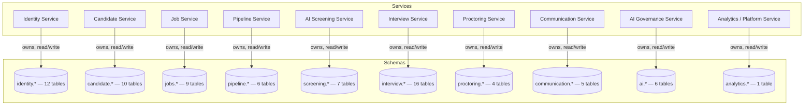

**Ownership rule enforced by the migration's design:** every schema owns its own tables exclusively; no table is defined in two schemas, and no cross-schema FK exists. This is what allows (per the migration's own docstring) each schema to "later be lifted into its own physical database" without a data-model rewrite — only the reference-ID lookups would need to become network calls.

---

## 4. Cross-Schema Reference Diagram

### 4.1 Candidate journey — reference-ID chain

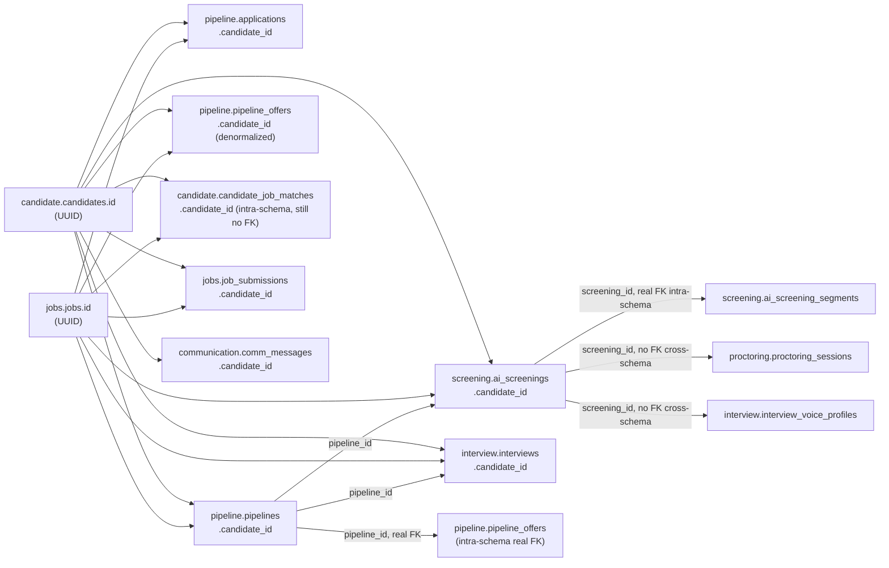

### 4.2 Real Foreign Keys vs. Reference IDs

| Type | Definition | Example |
|---|---|---|
| **Real Foreign Key** | Declared with `REFERENCES` + `CONSTRAINT ..._fkey`, enforced by Postgres, always **within the same schema** (one exception: the composite tenant FK inside `candidate`, still intra-schema) | `screening.ai_screening_answers.question_id → screening.ai_screening_questions.id ON DELETE CASCADE` |
| **Reference ID** | Plain `UUID` column, indexed, documented in a migration source comment, resolved by application code calling the owning service (in-process today, would be an API/event call post-split) | `interview.interviews.candidate_id → candidate.candidates.id` (**no constraint** — Postgres will not stop you from inserting a candidate_id that doesn't exist) |

**Full reference-ID inventory** (from migration comments, verbatim intent):

| Table (schema) | Column | Points to |
|---|---|---|
| `candidate.candidates` | `created_by` | `identity.profiles.id` |
| `candidate.sourcing_sessions` | `organization_id`, `created_by` | `identity.organizations.id`, `identity.profiles.id` |
| `candidate.candidate_job_matches` | `job_id` | `jobs.jobs.id` |
| `candidate.candidate_placement_history` | `job_id` | `jobs.jobs.id` |
| `jobs.client_recruiter_assignments` | `recruiter_id` | `identity.profiles.id` |
| `jobs.jobs` | `created_by` | `identity.profiles.id` |
| `jobs.client_job_access` | `user_id` | `identity.profiles.id` |
| `jobs.job_submissions` | `submitted_by`, `vendor_id`, `candidate_id` | `identity.profiles.id` (x2), `candidate.candidates.id` |
| `jobs.job_vendors` | `vendor_id` | `identity.profiles.id` |
| `pipeline.applications` | `candidate_id`, `job_id` | `candidate.candidates.id`, `jobs.jobs.id` |
| `pipeline.pipelines` | `candidate_id`, `job_id` | `candidate.candidates.id`, `jobs.jobs.id` |
| `screening.ai_screenings` | `candidate_id`, `job_id` | `candidate.candidates.id`, `jobs.jobs.id` |
| `interview.invites` | `organization_id` | `identity.organizations.id` |
| `interview.interview_booking_links` | `job_id`, `organization_id`, `pipeline_id`, `candidate_id`, `recruiter_id` | `jobs.jobs.id`, `identity.organizations.id`, `pipeline.pipelines.id`, `candidate.candidates.id`, `identity.profiles.id` |
| `interview.interview_voice_profiles` | `screening_id` | `screening.ai_screenings.id` |
| `interview.interviews` | `candidate_id`, `pipeline_id`, `job_id` | `candidate.candidates.id`, `pipeline.pipelines.id`, `jobs.jobs.id` |
| `interview.interview_reschedule_history` | `changed_by` | `identity.profiles.id` |
| `proctoring.proctoring_sessions` | `screening_id` | `screening.ai_screenings.id` |
| `communication.comm_messages` | `candidate_id` | `candidate.candidates.id` |
| `communication.comm_reminders` | `candidate_id` | `candidate.candidates.id` |
| `ai.ai_cost_alerts` | `organization_id` | `identity.organizations.id` |
| `ai.ai_log_retention_config` | `organization_id` | `identity.organizations.id` (nullable = global default row) |
| `ai.ai_request_log` | `organization_id` | `identity.organizations.id` |

In addition, **almost every table across every schema** carries an `organization_id` (or `org_id`) column tying it back to `identity.organizations.id` — this is the universal multi-tenancy key, and it is *never* a real FK outside `identity` itself.

### 4.3 Why reference IDs instead of foreign keys

1. **Independent deployability.** The migration's own docstring states the intent: each schema should be liftable "into its own physical database." A cross-schema FK in Postgres requires both tables to live in the same database/cluster — it would block ever splitting a schema out to its own service database.
2. **Service-boundary integrity.** Each service is meant to own writes to its schema. A real FK from `interview.interviews.candidate_id` into `candidate.candidates` would mean the interview service (or Postgres, on its behalf) needs direct knowledge of and access to the candidate table's constraints — coupling two services at the storage layer, not just the API layer.
3. **Consistent soft-delete / merge semantics.** `candidate.candidates` supports soft delete (`deleted_at`) and record merging (`merged_into_id`/`is_merged`). A hard FK with `ON DELETE CASCADE` from every downstream schema would either block soft-deletes silently succeeding at the app layer, or require every consumer schema to special-case merged/deleted candidates — logic that is easier to centralize in the candidate service.
4. **Trade-off accepted:** referential integrity across schemas is **not** enforced by the database. Orphaned reference IDs (e.g., an `interview.interviews.job_id` pointing at a deleted job) are possible and must be handled defensively by service-layer code (nullable checks, "not found" handling) rather than relying on the database to reject bad writes.

---

## 5. Data Flow Diagram — Candidate → Placement Lifecycle

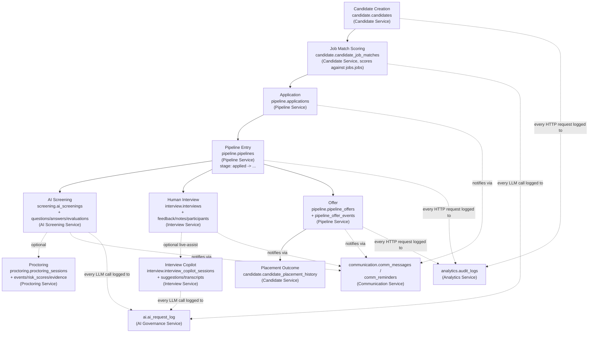

**Ownership at each step:**

| Step | Table(s) of record | Owning service | Cross-schema inputs consumed (by reference ID only) |
|---|---|---|---|
| Candidate Creation | `candidate.candidates` | Candidate Service | `created_by` → identity profile |
| Job Matching | `candidate.candidate_job_matches` | Candidate Service | `job_id` → jobs |
| Application | `pipeline.applications` | Pipeline Service | `candidate_id`, `job_id` |
| Pipeline / Stage tracking | `pipeline.pipelines`, `pipeline_stage_history`, `pipeline_status_history` | Pipeline Service | `candidate_id`, `job_id` |
| AI Screening | `screening.ai_screenings` + 6 child tables | AI Screening Service | `candidate_id`, `job_id`, `pipeline_id` |
| Proctoring (optional) | `proctoring.proctoring_sessions` + 3 child tables | Proctoring Service | `screening_id` |
| Human Interview | `interview.interviews` + 9 child tables | Interview Service | `candidate_id`, `pipeline_id`, `job_id` |
| Offer | `pipeline.pipeline_offers`, `pipeline_offer_events` | Pipeline Service | `pipeline_id` (real FK, intra-schema); `candidate_id`/`job_id` denormalized |
| Placement | `candidate.candidate_placement_history` | Candidate Service | `job_id` |
| Notifications (every step) | `communication.comm_messages`, `comm_reminders` | Communication Service | `candidate_id` |
| AI cost tracking (every AI call) | `ai.ai_request_log` | AI Governance Service | `organization_id`, `user_id` |
| Request auditing (every HTTP call) | `analytics.audit_logs` | Analytics Service | `organization_id`, `user_id` |

---

## 6. Migration Architecture

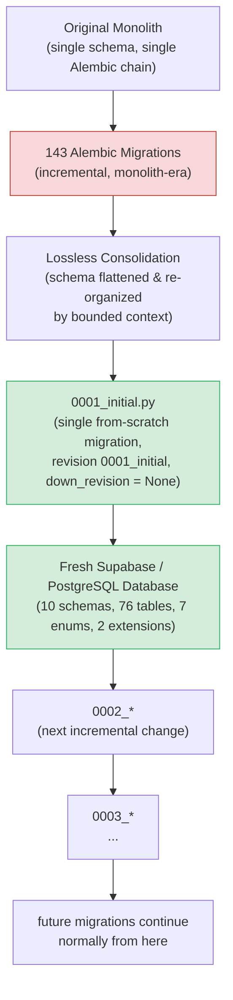

**Why the 143 historical migrations are no longer used:**

1. **They target a schema that no longer exists.** The consolidation reorganized tables from a single monolithic schema into 10 service-scoped schemas (`identity`, `candidate`, `jobs`, etc.). Replaying the old chain against a fresh database would recreate the old monolith layout, not the new microservices layout.
2. **`0001_initial.py` has `down_revision = None`.** Alembic treats it as a new root — it is not chained to any of the 143 prior revisions, so Alembic itself has no path that would apply them.
3. **A single consolidated migration is the correct baseline for a new database.** Replaying 143 incremental migrations (many of which likely added/renamed/dropped columns repeatedly) is slower and carries more risk (e.g., transient constraint states, extensions installed/dropped mid-chain) than applying one clean, reviewed `CREATE TABLE` set.
4. **The old chain is retained only as historical/audit record** (if kept in version control at all) — it is not part of the deployable migration path going forward. `0001_initial` is now the only starting point for any new environment.

Future schema changes should be added as `0002_*.py`, `0003_*.py`, etc., chained via `down_revision` from `0001_initial` (or from each other), following standard Alembic practice from this point forward — no more full-schema `op.execute` dumps; use `op.create_table` / `op.add_column` / `op.alter_column` primitives incrementally.

---

## STEP 3 — Database Review

### Counts

| Metric | Count |
|---|---|
| Schemas | 10 |
| Tables | 76 |
| Enum types | 7 (`ai.ai_pricing_status`, `ai.ai_request_status`, `identity.auth_security_event_type`, `identity.permission_effect`, `candidate.candidate_source_type`, `candidate.sourcing_result_action`, `candidate.sourcing_session_status`) |
| Extensions | 2 (`pgcrypto`, `pg_trgm`) |
| Real (enforced) FK constraints | 60+ (all intra-schema; 3 tables use a 3-column composite FK for tenant scoping) |
| Documented cross-schema reference-ID relationships | 23 distinct column-level references (see Section 4.2), plus the near-universal `organization_id`/`org_id` tenancy reference on almost every table |
| Tables with zero FKs (fully standalone) | All 6 tables in `ai`, the 1 table in `analytics`, plus `super_admin_audit_logs`, `sourcing_sessions`, `interviewer_profiles`, `invites`, `interview_voice_profiles`, `interviews`, `interview_booking_links`, `proctoring_sessions`, `comm_connections`, `applications`, `pipelines`, `ai_screenings` |

### Ownership map

See Section 1 (Schema Overview) and Section 3 (Service Ownership Diagram) — each of the 10 schemas maps 1:1 to exactly one owning service, with no shared tables.

### Database strengths

- **Clean bounded-context separation.** Schema-per-service with zero cross-schema FKs is a genuinely microservices-ready layout — a schema can be extracted to its own database by copying its tables and switching reference-ID lookups to API calls, with no FK constraints to untangle first.
- **Consistent UUID PKs + `gen_random_uuid()` defaults** across virtually every table, avoiding sequential-ID leakage and simplifying merges/replication.
- **Deliberate, documented reference-ID strategy.** Every cross-schema pointer is called out in a migration source comment — this is unusually good self-documentation for a schema-splitting effort and made this analysis possible without guessing.
- **Composite tenant FK in `candidate`** (`(id, org_id, workspace_id)`) is a strong pattern — it makes it a database-level error to attach an audit log, interaction, or skill to a candidate under the wrong org/workspace, closing a real multi-tenant leakage risk for that one schema.
- **Purpose-built append-only history tables** (`job_status_history`, `pipeline_stage_history`, `pipeline_status_history`, `interview_reschedule_history`, `candidate_audit_logs`) give first-class audit trails per domain rather than one giant generic log table.
- **AI cost governance is modeled as its own schema** (`ai`) with pricing master data, per-request logging, rate-limit logging, and configurable retention — a level of operational maturity around LLM spend not commonly seen this early.
- **Single, from-scratch, reviewed baseline migration.** Starting fresh from `0001_initial` avoids replaying 143 migrations' worth of accumulated inconsistency into new environments.

### Remaining technical debt

- **No database-level referential integrity across schemas.** By design (see Section 4.3), but it does mean orphaned reference IDs are possible in production and must be defended against in every service that reads them — there is no `ON DELETE` behavior across schema boundaries at all.
- **No SQLAlchemy `relationship()` mappings anywhere.** All 39 model files are flat column/FK definitions. This means every join is written by hand in service code, and `app/models/__init__.py` doesn't even centrally export the model classes — increasing the chance that a future contributor duplicates a model or misses an existing one.
- **`pipeline.applications` vs `pipeline.pipelines`.** Two tables with nearly identical shape (`organization_id`, `candidate_id`, `job_id`, `stage`, `status`, both `UNIQUE(candidate_id, job_id)`) exist side by side in the same schema with no FK between them. Whether `applications` is legacy/deprecated or serves a distinct purpose from `pipelines` **cannot be determined from the migration or models alone** — this needs a decision from the team, since it's an ambiguity risk (two "sources of truth" for pipeline state).
- **Duplicate FK constraints from consolidation.** `jobs.jobs.client_id` has two separate FK constraints (`fk_jobs_client_id_clients` and `jobs_client_id_fkey`) pointing at the same target; `identity.profiles.organization_id` similarly has two FK constraints (`fk_profiles_organization_id_organizations` and `profiles_organization_id_fkey`). Harmless functionally but visible cruft from the lossless-consolidation process that a `0002_*` cleanup migration should dedupe.
- **Redundant/legacy columns on `candidate.candidates`.** Both `merged_into_id` (has a real self-referencing FK) and `merged_into_candidate_id` (plain UUID, no FK) exist, alongside both `is_merged` and (implicitly) `merged_at`. Which pair is authoritative is not determinable from the schema alone.
- **Unused enum type.** `identity.permission_effect` (`'grant'`, `'deny'`) is created by the migration but is not referenced by any table column and does not appear anywhere else in the codebase — either dead/reserved-for-future-use, or a signal that a planned deny-based permission model was never wired up.
- **Inconsistent tenancy column naming.** Some schemas use `organization_id` (`identity`, `jobs`, `pipeline`, `screening`, `interview`, `ai`, `analytics`), others use `org_id` (`candidate`'s bulk-upload/audit/interaction/skill tables, all of `communication`) — same concept, two column names, which complicates any future automated cross-schema tooling (e.g., a generic tenant-scoping middleware).
- **No automated cross-schema integrity checker.** Given there are 23+ documented reference-ID relationships with no DB enforcement, there is currently no evidence in the repo of a scheduled job or test suite that checks for orphaned reference IDs — this would be a natural gap to close before splitting any schema into its own physical database.

### Future migration strategy

1. **Keep `0001_initial` as the permanent, non-replayable baseline.** Every environment (dev, staging, prod, and any new microservice's dedicated DB) starts from it.
2. **All new changes ship as small, additive `000N_*.py` migrations** chained by `down_revision`, using Alembic's `op.create_table` / `op.add_column` / `op.create_index` primitives (not raw multi-table `op.execute` dumps like `0001_initial` uses) — this keeps future diffs reviewable and reversible per-change.
3. **Address the flagged technical debt in an early `0002_*` cleanup migration**: drop the duplicate FK constraints on `jobs.jobs` and `identity.profiles`, and get a team decision on `applications` vs `pipelines` and the two `merged_into_*` columns before they accumulate more dependent code.
4. **When a schema is ready to be extracted to its own physical database**, its reference-ID columns become the seam: replace in-process reads of e.g. `candidate.candidates` from `interview.*` with calls to the Candidate Service's API, and stop assuming synchronous read-after-write consistency across schemas.
5. **Standardize tenancy column naming** (`organization_id` vs `org_id`) in a future migration once a decision is made, to simplify any generic tenant-scoping or RLS (row-level security) work.

---

## 7. Complete System Architecture — single diagram

This is the full picture: client, backend process, internal service modules, the orchestration layer that coordinates cross-schema workflows, the 10-schema database, and every external integration. Verified against `backend/app/main.py` (single FastAPI app, one `include_router` call per route module — **not** separately deployed microservices today) and `docs/INFRA.md` (external service inventory).

```mermaid
flowchart TB
    classDef client fill:#e1f5fe,stroke:#0277bd,color:#01579b
    classDef backend fill:#fff3e0,stroke:#ef6c00,color:#e65100
    classDef orch fill:#f3e5f5,stroke:#6a1b9a,color:#4a148c
    classDef db fill:#e8f5e9,stroke:#2e7d32,color:#1b5e20
    classDef ext fill:#eceff1,stroke:#455a64,color:#263238

    Browser["Browser / Client"]:::client --> FE["Frontend\nNext.js 15\nport 3000"]:::client
    FE -->|"REST /api/v1/*\n+ WebSocket"| API

    subgraph BACKEND["Backend — single FastAPI process (modular monolith), port 8000"]
        API["FastAPI app\napp/main.py\none process, one router registry"]:::backend
        subgraph ROUTES["Route modules (app/routes/*)"]
            R_AUTH["auth, me, roles,\npermission_catalog, invites, users"]:::backend
            R_CAND["candidate, candidate_notes,\ncandidate_management, sourcing"]:::backend
            R_JOB["job, client, ats, vendor"]:::backend
            R_PIPE["pipeline, application,\npipeline_analytics, offer"]:::backend
            R_SCR["ai_screening, ai_screening_ws,\nai_interview_questions"]:::backend
            R_IV["interview, interview_copilot,\ncopilot_ws"]:::backend
            R_MISC["dashboard, analytics, health"]:::backend
        end
        subgraph SVC["Service layer (app/services/*)"]
            S_CORE["candidate_service, job_service,\ninterview_service, pipeline_service,\noffer_service, ai_screening_service"]:::backend
            S_SUB["services/ai, ai_screening,\ncandidate_dedup, job_dedup,\nsourcing, transcription"]:::backend
        end
        ORCH["Orchestration layer\napp/orchestration/*\ncandidate_pipeline_withdrawal,\ninterview_scheduling, job_submission,\npipeline_transitions, screening_pipeline"]:::orch
        API --> ROUTES
        ROUTES --> SVC
        SVC --> ORCH
        ORCH -->|"cross-schema workflow calls\n(in-process, reference IDs)"| SVC
    end

    SVC -->|"SQLAlchemy, per-schema models\napp/models/*.py"| DBCLUSTER

    subgraph DBCLUSTER["PostgreSQL — Supabase (single physical cluster today)"]
        direction LR
        DB_ID[("identity\n12 tables")]:::db
        DB_CD[("candidate\n10 tables")]:::db
        DB_JB[("jobs\n9 tables")]:::db
        DB_PL[("pipeline\n6 tables")]:::db
        DB_SC[("screening\n7 tables")]:::db
        DB_IV[("interview\n16 tables")]:::db
        DB_PR[("proctoring\n4 tables")]:::db
        DB_CM[("communication\n5 tables")]:::db
        DB_AI[("ai\n6 tables")]:::db
        DB_AN[("analytics\n1 table")]:::db
    end

    S_SUB -->|"OPENAI_API_KEY"| EXT_OPENAI["OpenAI\nAI screening evaluation"]:::ext
    S_SUB -->|"GROQ_API_KEY /\nGROQ_API_KEY_ATS"| EXT_GROQ["Groq\nJD parsing, ATS enrichment"]:::ext
    S_SUB -.->|"GROK_API_KEY (optional)"| EXT_GROK["xAI Grok\nresume intelligence"]:::ext
    S_SUB -->|"ASSEMBLYAI_API_KEY"| EXT_ASM["AssemblyAI\ninterview transcription"]:::ext
    S_SUB -->|"LIVEKIT_API_KEY/SECRET"| EXT_LK["LiveKit\nlive video interviews"]:::ext
    S_SUB -.->|"TWILIO (optional)"| EXT_TW["Twilio\nWhatsApp notifications"]:::ext
    S_CORE -->|"SUPABASE_SERVICE_ROLE_KEY"| EXT_STORE["Supabase Storage\nresumes, JD documents"]:::ext
    S_CORE -->|"SMTP_HOST/USER/PASSWORD"| EXT_SMTP["Brevo SMTP\ninvite + transactional email"]:::ext
    S_SUB -.->|"GOOGLE_CLIENT_ID/SECRET (optional)"| EXT_GOOG["Google OAuth\nGmail integration"]:::ext
    S_SUB -.->|"MS_CLIENT_ID/SECRET (optional)"| EXT_MS["Microsoft OAuth\nOutlook integration"]:::ext
    ORCH -.->|"CELERY_BROKER_URL\n(if CELERY_DISPATCH_ENABLED)"| EXT_CEL["Celery + Redis\nbackground task dispatch"]:::ext

    SVC -.->|"reference-ID reads,\nno cross-schema FK"| DB_ID
    SVC --> DB_CD
    SVC --> DB_JB
    SVC --> DB_PL
    SVC --> DB_SC
    SVC --> DB_IV
    SVC --> DB_PR
    SVC --> DB_CM
    SVC --> DB_AI
    SVC --> DB_AN
```

**Key architectural fact this diagram makes explicit:** the *service* boundaries in this system exist today at the **schema and code-module level**, not at the **deployment/process level** — there is one backend process serving all ten domains. The database's schema-per-service design (zero cross-schema FKs, reference-ID-only cross-schema access — see Section 4) is what makes it *possible* to later split `BACKEND` into ten independently deployed services, one per schema, without a data-model rewrite. That split has not happened yet; this diagram reflects the system as it is actually built and run today, cross-checked against `app/main.py`'s router registration and `docs/INFRA.md`'s environment/integration inventory.
