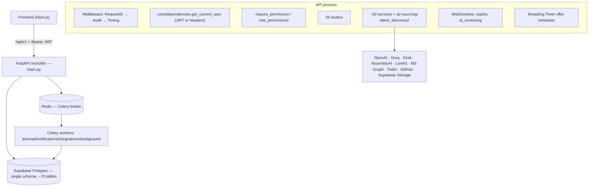
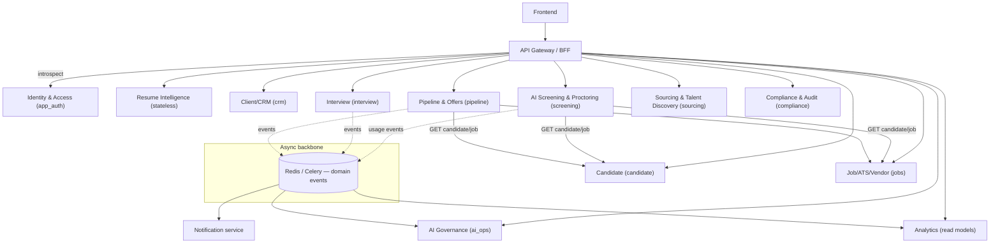
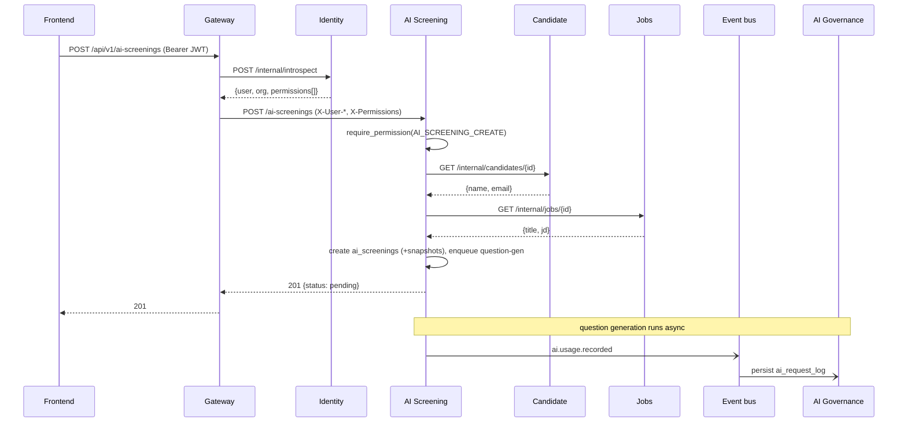
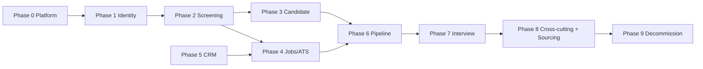
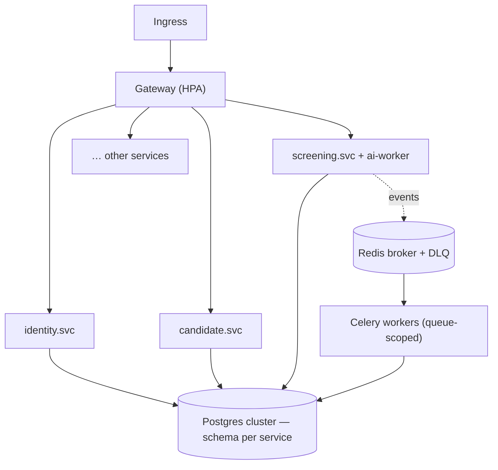

# AIRIS — Monolith → Microservices Migration Blueprint

> Official engineering reference for decomposing the AIRIS Recruitment Platform from a single FastAPI monolith into an independent, enterprise-grade microservice architecture.
>
> Every recommendation in this document is grounded in the current source tree under `backend/app`. File, class, model, router, and table references are cited inline so an implementing team can act without re-deriving architectural decisions.
>
> Status: **design only** — no code is changed by this document.

---

## Table of contents

1. [Executive summary](#1-executive-summary)
2. [Current system analysis](#2-current-system-analysis)
3. [Business domain analysis](#3-business-domain-analysis)
4. [Target microservice architecture](#4-target-microservice-architecture)
5. [Database migration strategy](#5-database-migration-strategy)
6. [API inventory and future ownership](#6-api-inventory-and-future-ownership)
7. [Cross-service communication design](#7-cross-service-communication-design)
8. [Migration roadmap](#8-migration-roadmap)
9. [Testing and validation strategy](#9-testing-and-validation-strategy)
10. [Deployment architecture](#10-deployment-architecture)
11. [Risk register](#11-risk-register)
12. [Final engineering assessment](#12-final-engineering-assessment)

---

## 1. Executive summary

### 1.1 Current architecture

AIRIS today is a **modular monolith**: one FastAPI application (`backend/app/main.py`) that mounts **35 routers** under `/api/v1`, backed by a single SQLAlchemy engine (`backend/app/db/session.py`) against one Supabase/PostgreSQL database. All ORM models share one declarative `Base` whose metadata is bound to a single schema (`backend/app/db/base.py`). There are ~70 tables, ~50 service modules, two in-process background mechanisms (a Celery cluster in `backend/app/celery_app.py` and a `threading.Timer` scheduler in `backend/app/scheduler.py`), two WebSocket endpoints (`backend/app/websocket/`), and a broad set of external AI/communication integrations declared in `backend/app/core/config.py`.

The code is already **domain-organised** (routers, models, and services group cleanly by capability) and authentication is **already gateway-friendly** — `get_current_user` (`backend/app/core/dependencies.py:127`) accepts identity either from a verified JWT *or* from trusted upstream headers (`X-User-Id`, `X-Organization-Id`, `X-User-Role`, `X-User-Type`). This is the single most important enabler for the chosen migration approach.

### 1.2 Target architecture

A distributed system of **independently deployable services**, each owning its own PostgreSQL **schema** (schema-per-service on one cluster initially, splittable to separate clusters later), fronted by an **API Gateway / BFF**. The Gateway is the only component that validates the end-user JWT; it then calls the Identity service to resolve identity + effective permissions and forwards them downstream as **signed identity headers** — the exact contract `get_current_user` already supports. Services never re-validate the raw user token; they trust the Gateway over a private network.

Inter-service data access that is an in-process ORM join today (e.g. AI Screening joining `candidates` and `jobs`) becomes a synchronous REST call to the owning service, with denormalised snapshots used to avoid chatty fan-out. Cross-domain workflow side effects (emails, reminders, analytics) move to **event-driven** messaging on the existing Celery/Redis backbone.

### 1.3 Business objectives

- Independent deployability and team ownership per domain (recruiting, AI, identity, compliance).
- Independent scaling of expensive AI workloads (screening, sourcing, ATS scoring) from cheap CRUD.
- Clear data ownership and auditability for enterprise/compliance (DPDPA) requirements.
- Faster, lower-blast-radius releases.

### 1.4 Technical objectives

- One schema per service; no cross-schema foreign keys; boundaries enforced at the database grant level.
- Stateless services behind a Gateway; horizontal scale per service.
- Centralised observability (the existing Sentry + structured logging + audit middleware become platform concerns).
- Strangler-fig migration — the monolith remains the default route target and shrinks as domains peel off, so the system never has a "big bang" cutover.

### 1.5 Benefits

| Benefit | Evidence today | After migration |
|---|---|---|
| Isolate AI cost/latency | All AI clients (`services/ai/`, Groq/OpenAI/Grok in `config.py`) run in the API process | AI Screening / Sourcing scale independently |
| Independent failure domains | One unhandled error path is caught globally in `main.py` for the whole app | A screening outage cannot take down auth/login |
| Data governance | Audit + AI logs co-mingle with business tables in one schema | `compliance` + `ai_ops` schemas owned by dedicated services |
| Team autonomy | Single deploy unit | Per-service CI/CD |

### 1.6 Migration strategy — Strangler Fig

1. Insert the Gateway in front of the unchanged monolith (header-injection contract proven, zero behaviour change).
2. Extract **Identity & Access** first (cleanest boundary — see §5).
3. Extract **AI Screening** next (first true cross-service data contract — proves the candidate/job fetch pattern).
4. Peel off core transactional domains (Candidate, Job/ATS, Pipeline, Interview, Client).
5. Extract cross-cutting services last (AI Governance, Compliance, Notifications, Analytics).

### 1.7 Guiding architectural principles

- **Database-per-service** (schema-per-service initially). A service may only read/write its own schema.
- **No distributed transactions.** Use sagas/events for multi-service workflows.
- **API ownership is exclusive.** Exactly one service owns each table and each write path.
- **The Gateway owns end-user auth; services own authorization** against forwarded permissions.
- **Backwards compatibility during transition** — every extracted route keeps its `/api/v1/...` path so the frontend (`frontend/`) is unchanged.
- **Evidence over assumption** — boundaries follow the existing FK graph and import graph, not idealised theory.

### 1.8 Constraints

- New migration repository, **new Supabase project, empty database, no production data** — schema DDL can be authored fresh; there is no data backfill risk.
- Schema-based isolation (not separate databases) for the first cut, per project constraint.
- Inter-service auth = **Gateway injects identity headers** (decided).
- Python/FastAPI/SQLAlchemy/Alembic stack retained; Supabase Postgres + Redis (Celery broker) retained.

### 1.9 Assumptions

- Supabase Auth is **not** the identity authority — AIRIS issues its own JWTs (`backend/app/core/security.py`), so Identity extraction is fully under our control.
- `organization_id` is a logical tenant key carried on almost every table as a **bare UUID without a foreign key** (confirmed across the model set) — multi-tenant scoping survives schema separation with no FK rework.
- The frontend talks only to `/api/v1` and can be repointed at the Gateway with no code change.

### 1.10 Risks (summary; full register in §11)

- Distributed authorization staleness (forwarded permissions).
- Chatty cross-service reads replacing in-process joins (screening/pipeline → candidate/job).
- Identity-header spoofing if a service is reachable outside the Gateway.
- Operational complexity (many deploy units, distributed tracing required).

### 1.11 Success criteria

- Each service deploys independently with its own migration history and health check.
- No service holds a DB grant on another service's schema.
- All existing `/api/v1` contracts pass an unchanged end-to-end suite through the Gateway.
- p95 latency on candidate/job-dependent endpoints stays within +20% of monolith baseline after introducing remote reads.

---

## 2. Current system analysis

### 2.1 Folder structure (`backend/app`)

```
app/
├── main.py                 # FastAPI app, 35 router includes, exception handlers, middleware order
├── celery_app.py           # Celery cluster: 6 queues + beat schedule
├── scheduler.py            # threading.Timer offer-expiry scheduler
├── core/                   # config, dependencies (auth), security (JWT), permissions,
│                           #   limiter, audit_middleware, request_id, lifespan, openapi, error_codes
├── db/                     # base.py (declarative Base + schema), session.py (engine, get_db)
├── models/                 # ~40 model modules, ~70 tables
├── schemas/                # Pydantic request/response models
├── routes/                 # 35 routers
├── services/               # ~50 service modules + ai/ sourcing/ talent_discovery/
│                           #   transcription/ candidate_dedup/ job_dedup/ auth/ subpackages
├── candidate_management/   # self-contained bounded module (resume mgmt): api, service,
│                           #   repository, storage, search, parsers, communication
├── analytics/              # repository + routes + service + schemas (reporting)
├── websocket/              # copilot_ws, ai_screening_ws, registry
├── tasks/                  # 8 Celery task modules
├── documents/              # file security + docx/html preview
├── exceptions/, utils/, config/
└── alembic/                # 143 migration versions, env.py
```

### 2.2 Startup flow

`main.py` → Sentry init (if DSN) → `FastAPI(lifespan=app_lifespan)` → register rate limiter (`app.state.limiter`) → mount `/uploads` static → custom OpenAPI → CORS → exception handlers → middleware → 35 `include_router` calls.

`app_lifespan` (`core/lifespan.py`) on startup:
- spawns a daemon thread `_backfill_permissions` → `signup_permissions.backfill_all_organizations` (seeds role→permission rows for every org);
- starts the offer-expiry scheduler (`scheduler.start_offer_expiry_scheduler`);
- optionally validates speaker-verification deps (feature-flagged `enable_speaker_verification`);

on shutdown: `mark_shutting_down`, stop scheduler, `shutdown_task_runner`, cancel pending WS notifications, `shutdown_all_websockets` (5 s timeout).

**Migration note:** the startup permission backfill and the offer scheduler are domain-specific (Identity and Pipeline/Offers respectively) but currently run in the API process — they must move into their owning services.

### 2.3 Request lifecycle

Middleware order (registered last = outermost, per `main.py:328`):
1. `RequestIDMiddleware` (outermost) — generates/accepts `X-Request-ID`, writes it to ASGI `scope["state"]`.
2. `AuditLogMiddleware` — pure-ASGI; for every **non-GET** request captures method/path/status/duration/body (PII-scrubbed via `_PII_FIELDS`, 10 KB cap), and writes an `audit_logs` row **after** the response is sent via a `ThreadPoolExecutor` (zero added latency).
3. `request_timing_middleware` (`@app.middleware("http")`) — sets `X-Response-Time`, logs `slow_request` >500 ms.
4. Route dependencies: `get_current_user` resolves identity, `require_permission`/`require_roles` enforce authz, `get_db` yields a session.

Exception handling is centralised in `main.py`: `StarletteHTTPException`, `RequestValidationError`, `ResponseValidationError`, and a catch-all `Exception` handler all return structured bodies with `code` (`core/error_codes.ErrorCode`) and `request_id`.

### 2.4 Authentication & authorization

- **JWT, HS256, shared secret** `settings.jwt_secret_key` (`core/security.py`). Access + refresh tokens, `jti`, `typ`, optional `sid` (session id), `token_version`, `organization_id` claims.
- `get_current_user` (`core/dependencies.py:127`) resolution order:
  1. cached `request.state.airis_current_user`;
  2. `request.state.user` (set by middleware, if any);
  3. **Bearer JWT** — decode, load `Profile`, enforce `token_version`, soft-delete (`deleted_at`), org-scope match, and **session revocation** via `AuthSession.sid` (gracefully degrades if the `auth_sessions` table is absent);
  4. **trusted upstream headers** `X-User-Id`/`X-Organization-Id`/`X-User-Role`/`X-User-Type` (the gateway path).
- **Authorization** is permission-based: `require_permission(perm)` and `require_any_permissions(...)` resolve effective permissions via `PermissionService.get_user_permissions` reading `role_permissions` joined to `organization_roles` (`core/dependencies.py:81`). `require_roles`/`require_admin`/`require_super_admin` are coarse role gates. Permissions are cached per-request on `request.state`.

This is the seam the whole migration pivots on: **the JWT validation + permission lookup is the only thing every other domain needs from Identity.**

### 2.5 Database layer

- One engine in `db/session.py`. For Supabase pooler URLs it uses **`NullPool`** + `prepare_threshold=None` (pgBouncer compatibility — documented at length in the file); otherwise a normal pool (`pool_size=5`, `max_overflow=10`).
- `db/base.py` binds `Base.metadata` to a single `settings.db_schema`. **All models live in one schema today** — this is the central change for schema-per-service.
- 143 Alembic versions; `alembic/env.py` imports every model explicitly so autogenerate sees the full metadata.

### 2.6 Background workers & scheduling

- **Celery** (`celery_app.py`) — 6 queues: `ai`, `email`, `notifications`, `integrations`, `background`, `deadletter`; Redis broker/result backend (`config.py`); `celery_dispatch_enabled` flag falls back to an in-process `ThreadPoolExecutor` (`services/task_runner.py`) when Redis is absent. **Beat schedule**: invite reminders (hourly), invite expiry sweep (hourly), interview reminders (5 min), screening reminders (5 min), two daily jobs (retention/cleanup). Task modules in `tasks/`: `ai_tasks`, `email_tasks`, `notification_tasks`, `integration_tasks`, `interview_reminder_tasks`, `screening_reminder_tasks`, `invite_tasks`, `dlq_tasks`.
- **threading.Timer** (`scheduler.py`) — offer-expiry alert scan 5 min after boot, then every 24 h, calling `OfferService.process_expiry_alerts`.

### 2.7 WebSockets

`websocket/copilot_ws.py` (live interview copilot transcription/suggestions) and `websocket/ai_screening_ws.py` (live AI screening interview), coordinated by `websocket/registry.py` (graceful shutdown). Both are mounted under `/api/v1`.

### 2.8 AI integrations

Declared in `config.py`, consumed in `services/ai/` and elsewhere:
- **OpenAI** (`openai_screening_model=gpt-4.1-mini`) — AI screening evaluation, copilot, Whisper transcription.
- **Groq** — multiple distinct keys/models: resume/JD parse (`groq_api_key` + backup), ATS enrichment (`groq_ats_*`), AI interview (`groq_api_key_aiinterview`), sourcing (`groq_api_key_sourcing`).
- **xAI Grok** (`grok_*`) — hybrid ATS semantic enrichment.
- **AssemblyAI** — streaming transcription (copilot/screening).
- **LiveKit** — embedded video (`livekit_*`) for live interviews.
- Every AI call is metered through `services/ai/ai_logging_service.log_ai_request_sync` → `ai_request_log` (cost/token governance).

### 2.9 Other external integrations

- **Microsoft Graph** transactional email (`graph_email_provider.py`, `entra_*` config) — primary email channel; Brevo SMTP legacy.
- **Google / Microsoft OAuth** — calendar/communication sync (`integration_tasks`, `communication_service`).
- **Twilio WhatsApp** — candidate comms.
- **GitHub API** — talent discovery connector (`services/talent_discovery/connectors`, `github_service.py`).
- **Supabase Storage** — avatars bucket, resume files (`candidate_management/storage.py`), interview recordings (`interview_storage_service.py`), screening video/audio.
- **Sentry** — error tracking + tracing.

### 2.10 Current architecture diagram



---

## 3. Business domain analysis

The repository decomposes cleanly into the domains below. **The decomposition follows two hard signals from the code: the foreign-key graph (who points at whom) and the import graph (who calls whom).** Where the prompt's suggested domain list differs from the code, the code wins and the reason is stated.

### Domain map

```mermaid
flowchart LR
  subgraph Identity["Identity & Access"]
    A1[profiles] --- A2[organizations] --- A3[organization_roles] --- A4[role_permissions] --- A5[permissions]
    A6[auth_sessions] --- A7[mfa_trusted_devices] --- A8[invites] --- A9[workspaces]
  end
  subgraph Candidate
    C1[candidates] --- C2[candidate_placement_history] --- C3[candidate notes]
  end
  subgraph Resume["Resume Intelligence"]
    RM[candidate_management: parse/store/search]
  end
  subgraph Jobs["Jobs / ATS / Vendor"]
    J1[jobs] --- J2[job_skills] --- J3[job_submissions] --- J4[job_vendors] --- J5[candidate_job_matches] --- J6[job_match_cache]
  end
  subgraph CRM["Client / CRM"]
    CL1[clients] --- CL2[client_recruiter_assignments] --- CL3[client_job_access]
  end
  subgraph Pipeline["Pipeline & Offers"]
    P1[pipelines] --- P2[applications] --- P3[pipeline_offers]
  end
  subgraph Interview
    I1[interviews] --- I2[interview_feedback] --- I3[interviewer_profiles] --- I4[interview_booking_links] --- I5[interview_copilot_sessions]
  end
  subgraph Screening["AI Screening + Proctoring"]
    S1[ai_screenings] --- S2[ai_screening_questions/answers/evaluations] --- S3[proctoring_sessions]
  end
  subgraph Sourcing["Sourcing & Talent Discovery"]
    SO1[sourcing_sessions] --- SO2[sourcing_results]
  end
  subgraph XCut["Cross-cutting"]
    G1[ai_request_log / ai_cost_alerts] --- G2[audit_logs] --- G3[Notifications/Email] --- G4[Analytics/Dashboard]
  end
```



### Per-domain detail

#### 3.1 Identity & Access (Authentication, Org, Users, Roles, Workspaces)
- **Purpose:** authenticate users, manage organizations, users, roles/permissions, MFA, invites, and (currently) workspaces.
- **Implementation:** routers `auth.py`, `mfa.py`, `users.py`, `roles.py`, `me.py`, `profile.py`, `permission_catalog.py`, `org_settings.py`, `workspaces.py`, `invites.py`, `super_admin_org.py`. Services: `services/auth/`, `organization_role_service.py`, `permission_service.py`, `license_service.py`, `profile_service.py`, `workspace_service.py`. Core: `security.py`, `dependencies.py`, `signup_permissions.py`.
- **Tables:** `profiles`, `organizations`, `organization_roles`, `role_permissions`, `permissions`, `auth_sessions`, `auth_security_logs`, `mfa_trusted_devices`, `email_verification_tokens`, `invites`, `workspaces`, `workspace_settings`.
- **Dependencies / coupling:** **everything depends on it** for authn/authz, but Identity depends on nothing else. Its FKs are entirely self-contained (`profiles→organizations,organization_roles`; `role_permissions→organizations,organization_roles`; `auth_sessions→organizations,profiles`). This is the cleanest service to extract.
- **Technical debt:** `workspaces` is provisioned at signup (`workspace_service.provision_workspace`) yet also surfaced by the interview domain (`GET /interviews/{id}/workspace`). Workspace ownership needs an explicit decision (kept in Identity here; see §4.2).
- **Recommended service:** **Identity & Access service** (`app_auth` schema).

#### 3.2 Candidate Management
- **Purpose:** authoritative candidate records, duplicate detection/merge, placement history, notes.
- **Implementation:** `candidate.py`, `candidate_notes.py`; services `candidate_service.py`, `candidate_dedup/` (detection + merge + phone normalizer), `candidate_hard_delete.py`, `candidate_pipeline_withdrawal.py`, `placement_history_service.py`.
- **Tables:** `candidates` (self-ref `merged_into_id`, FK `created_by→profiles`), `candidate_placement_history` (→ candidates, jobs), candidate notes.
- **Coupling:** referenced by **almost every other domain** (`ai_screenings`, `pipelines`, `applications`, `interviews`, `job_submissions`, `sourcing_results`, `booking_links` all FK `candidates.id`). Candidate is a **core upstream** service.
- **Recommended service:** **Candidate service** (`candidate` schema).

#### 3.3 Resume Management / Parsing (`candidate_management` package)
- **Purpose:** resume upload/storage, parsing (local + AI adapters), candidate search, candidate communication (email/WhatsApp/calendar).
- **Implementation:** the self-contained `candidate_management/` package — `api.py` (router, no prefix → mounted at `/api/v1/candidate-management`), `service.py`, `repository.py`, `storage.py` (Supabase), `search.py`, `local_parser_adapter.py`, `ai_adapter.py`, `communication_service.py`, `tasks.py`, `tasks_ats.py`, plus `services/resume_parser.py`, `resume_intelligence_service.py`.
- **Coupling:** operates on candidates; heavy Groq usage; owns file storage and the candidate communication OAuth tokens.
- **Recommended service:** **Resume Intelligence service** (stateless compute + storage; reads/writes Candidate via API) — justified because it is already an isolated package with distinct AI + storage + OAuth dependencies and a different scaling profile from candidate CRUD. May alternatively fold into Candidate if team size is small (see §4 trade-off note).

#### 3.4 Job, ATS & Vendor Management
- **Purpose:** job requisitions, JD parsing, job↔candidate matching (ATS), vendor submissions, job-status history.
- **Implementation:** `job.py` (~28 endpoints), `ats.py`, `vendor.py`; services `job_service.py`, `job_dedup/`, `jd_normalization_service.py`, `ai_ats_service.py`, `ats_extraction_service.py`, `ats_matching_service.py`, `ats_pair_cache.py`, `ats_pipeline_status.py`, `semantic_matching_service.py`.
- **Tables:** `jobs` (→ clients, profiles), `job_skills`, `job_status_history`, `job_submissions` (→ jobs, candidates, profiles), `job_vendors` (→ jobs, profiles), `candidate_job_matches` (→ jobs), `job_match_cache` (→ jobs), `client_job_access` (→ profiles, jobs).
- **Coupling:** `jobs→clients` (CRM); ATS matching reads candidate resume text; referenced by pipeline/interview/screening.
- **Recommended service:** **Job & Requisition service** (`jobs` schema), with **ATS scoring** as an internal AI-heavy module and **Vendor** as a sub-capability (vendors are AIRIS users with a vendor role submitting to jobs — `job_vendors→profiles`).

#### 3.5 Client / CRM
- **Purpose:** client companies, recruiter↔client assignments, client portal job access.
- **Implementation:** `client.py`; `client_service.py`, `access_scope_service.py`.
- **Tables:** `clients`, `client_recruiter_assignments` (→ clients, profiles), `client_job_access` (→ profiles, jobs).
- **Coupling:** `jobs→clients`; `client_job_access` spans CRM + Jobs (a cross-service link to resolve).
- **Recommended service:** **Client/CRM service** (`crm` schema).

#### 3.6 Pipeline, Applications & Offers
- **Purpose:** the hiring funnel — pipeline stages, stage history, applications, offer lifecycle + expiry.
- **Implementation:** `pipeline.py`, `pipeline_analytics.py`, `application.py`, `offer.py`; `pipeline_service.py`, `pipeline_stage_notification_service.py`, `pipeline_analytics_service.py`, `application_service.py`, `offer_service.py`; `scheduler.py` (offer expiry).
- **Tables:** `pipelines` (→ candidates, jobs), `pipeline_status_history`, `pipeline_stage_history`, `applications` (→ candidates, jobs), `pipeline_offers` (→ pipelines), `pipeline_offer_events` (→ pipelines, pipeline_offers).
- **Coupling:** the **hub of the recruiting workflow** — `interviews`, `ai_screenings`, and `booking_links` all FK `pipelines.id`. Heavy reader of Candidate + Job.
- **Recommended service:** **Pipeline & Offers service** (`pipeline` schema). The offer-expiry scheduler moves here.

#### 3.7 Interview (scheduling, feedback, copilot, booking)
- **Purpose:** schedule interviews, manage interviewers/availability, capture feedback/notes, reschedule, reminders, self-booking links, and the real-time AI interview copilot.
- **Implementation:** `interview.py` (~30 endpoints), `interview_copilot.py`, `booking.py`; `websocket/copilot_ws.py`; services `interview_service.py`, `interview_notification_service.py`, `interview_reminder_service.py`, `interview_storage_service.py`, `interview_join_url.py`, `reschedule_token_service.py`, `booking_service.py`, `copilot_service.py`, `livekit_service.py`, `services/ai/copilot_suggester.py`, `interview_summary.py`.
- **Tables:** `interviews` (→ pipelines, candidates, jobs), `interview_participants`, `interview_feedback`, `interviewer_profiles`/`interviewer_skills`/`interviewer_availability`, `interview_notes`, `interview_reschedule_history`, `interview_reminders`, `interview_booking_links`/`interview_booking_slots`, `interview_copilot_sessions`/`interview_transcript_segments`/`interview_ai_suggestions`.
- **Recommended service:** **Interview service** (`interview` schema). Copilot is an internal real-time sub-module; Booking is a sub-capability with public (unauthenticated-token) endpoints.

#### 3.8 AI Screening & Proctoring
- **Purpose:** async + live AI screening interviews (question generation, answer evaluation, scoring, recommendation), self-service invite flow, and exam proctoring.
- **Implementation:** `ai_screening.py` (~30 endpoints), `ai_interview_questions.py`, `proctoring.py`; `websocket/ai_screening_ws.py`; services `ai_screening_service.py`, `ai_screening_email.py`, `ai_screening_reminder_service.py`, `services/ai/question_generator.py`, `answer_evaluator.py`, `recommendation_engine.py`, `recruiter_summary.py`, `threshold_service.py`, `speaker_verification_service.py`, `audio_processing_service.py`, `services/transcription/`.
- **Tables:** `ai_screenings` (→ candidates, jobs, pipelines), `ai_screening_questions`/`answers`/`evaluations`/`reminders`/`messages`, `ai_screening_segments`; **Proctoring:** `proctoring_sessions` (→ **ai_screenings**), `proctoring_events`, `proctoring_evidence`, `proctoring_risk_scores`, `interview_voice_profiles` (→ ai_screenings).
- **Coupling / key finding:** **Proctoring foreign-keys to `ai_screenings`, not `interviews`** (`models/proctoring.py:22,145`). Therefore Proctoring belongs with **AI Screening**, not Interview. `ai_screening_service.py` imports the `Candidate` and `Job` ORM models directly (`services/ai_screening_service.py:31-32`) and the table FKs candidates/jobs/pipelines — **this is the principal cross-service contract to build.**
- **Recommended service:** **AI Screening service** (`screening` schema), Proctoring as an internal module (extractable later).

#### 3.9 Sourcing & Talent Discovery
- **Purpose:** AI candidate sourcing sessions (query generation, dedup, scoring, import) and external talent discovery (GitHub etc., JD-driven search + import).
- **Implementation:** `sourcing.py`, `talent_discovery.py`; `services/sourcing/` (runner, query_generator, deduplicator, scorer, importer, providers), `services/talent_discovery/` (connectors, jd_extractor, intelligence, scoring, importer), `github_service.py`.
- **Tables:** `sourcing_sessions` (→ organizations, profiles), `sourcing_results` (→ sourcing_sessions, candidates). Talent Discovery itself is **stateless search + import** (no dedicated table) — it creates Candidate records on import.
- **Recommended service:** **Sourcing service** (`sourcing` schema); Talent Discovery as a module that imports into Candidate via API.

#### 3.10 AI Governance & Cost Monitoring (cross-cutting)
- **Purpose:** meter AI token/cost usage, enforce rate limits, alert on cost thresholds, retain/purge AI logs.
- **Implementation:** `super_admin_ai_cost.py`, `admin_rate_limits.py`; `services/ai/ai_logging_service.py`, `ai_log_retention_service.py`, `core/ai_rate_limiter.py`, `threshold_service.py`.
- **Tables:** `ai_request_log` (→ organizations), `ai_rate_limit_log`, `ai_cost_alerts` (→ organizations), `ai_model_pricing_master`, `ai_log_retention_config` + `ai_log_cleanup_audit`.
- **Coupling:** every AI-producing service writes here via `log_ai_request_sync`. Becomes an **event consumer** (fire-and-forget usage events) rather than a synchronous in-process write.
- **Recommended service:** **AI Governance service** (`ai_ops` schema).

#### 3.11 Compliance & Audit (cross-cutting)
- **Purpose:** immutable request audit trail and DPDPA consent management / data-subject rights.
- **Implementation:** `core/audit_middleware.py`, `dpdpa.py`; `gdpr_service.py`, `user_retention_service.py`, `core/consent_templates.py`.
- **Tables:** `audit_logs` (bare user/org UUIDs, no FK — already isolation-friendly), consent records.
- **Recommended service:** **Compliance & Audit service** (`compliance` schema). The audit middleware becomes a shared platform library that ships audit events to this service.

#### 3.12 Notifications & Email (cross-cutting)
- **Purpose:** transactional email (MS Graph), in-app/push notifications, WhatsApp, and reminder dispatch.
- **Implementation:** `email_service.py`, `graph_email_provider.py`, `*_email_templates.py`, `*_notification_service.py`, Celery `email_tasks`/`notification_tasks`/`*_reminder_tasks`.
- **Tables:** none authoritative (reminders are owned by Interview/Screening/Invite). 
- **Recommended service:** **Notification service** — stateless dispatcher that consumes domain events; templates live with it.

#### 3.13 Reporting, Dashboard & Analytics (cross-cutting)
- **Purpose:** cross-domain dashboards and pipeline analytics.
- **Implementation:** `dashboard.py`, `analytics/` package, `pipeline_analytics.py`/`pipeline_analytics_service.py`.
- **Tables:** none authoritative — pure read aggregations across domains.
- **Recommended service:** **Analytics service** (CQRS read models populated from domain events; no authoritative writes).

#### 3.14 Shared platform & Gateway
- **Gateway/BFF:** new component (no current equivalent — the monolith *is* the entry point).
- **Shared library** (extracted from `core/`): `request_id`, `error_codes`, `limiter`, audit shipping, the **gateway-auth dependency** (a thin `get_current_user` that trusts headers only), and the `CurrentUser`/error Pydantic contracts.

---

## 4. Target microservice architecture

### 4.1 Service catalog overview



### 4.2 Per-service specification

Each service shares a common template; only the distinguishing rows are detailed below. **Common to all:** authentication = trust Gateway identity headers (no token validation); authorization = `require_permission` against forwarded `X-Permissions`; logging = structured JSON + `X-Request-ID` propagation; monitoring = Sentry + RED metrics; health = `GET /health` (liveness) and `GET /health/ready` (DB + downstream checks) modelled on the existing `routes/health.py`; Docker = slim Python image, `uvicorn` + optional Celery worker sidecar; deployment = independent pipeline, rolling/blue-green; scaling = horizontal stateless replicas.

#### Service 0 — API Gateway / BFF
- **Purpose:** single entry point; validate end-user JWT; resolve identity + permissions from Identity; inject `X-User-Id/-Organization-Id/-User-Role/-User-Type/-Permissions` + `X-Request-ID`; route by path prefix; terminate CORS; host the global rate limiter (`core/limiter.py`).
- **Owns:** no schema. Holds the JWT public/secret config and a short-TTL permission cache.
- **APIs exposed:** all `/api/v1/*` (proxied). Publishes nothing.
- **Scaling:** highest replica count; CPU-bound on JWT verify.

#### Service 1 — Identity & Access (`app_auth`)
- **Responsibilities:** signup/login/refresh/logout, MFA, users, roles & permissions, invites, organizations, org settings/license, workspaces, profile.
- **Owns tables:** `profiles, organizations, organization_roles, role_permissions, permissions, auth_sessions, auth_security_logs, mfa_trusted_devices, email_verification_tokens, invites, workspaces, workspace_settings`.
- **APIs exposed (external):** `POST /auth/signup|login|refresh|logout`, `/auth/mfa/*`, `/users/*`, `/roles/*`, `/me/permissions`, `/profile`, `/org/settings`, `/workspaces/*`, `/invites/*`.
- **APIs exposed (internal):** `POST /internal/introspect` → `{user_id, organization_id, role, type, permissions[], token_version}` for the Gateway; `GET /internal/users/{id}` and `GET /internal/users?ids=` for other services that need names/emails.
- **Events published:** `user.created`, `user.deactivated`, `org.created`, `role.permissions.changed` (lets services invalidate permission caches).
- **Notes:** absorbs the startup `_backfill_permissions` job and the `signup_permissions` seeding.

#### Service 2 — Candidate (`candidate`)
- **Responsibilities:** candidate CRUD, duplicate detect/merge, placement history, notes, archive/restore/hard-delete.
- **Owns:** `candidates, candidate_placement_history`, candidate notes, `candidate_job_matches`* (*ownership decision: matches are produced by ATS but keyed by candidate+job — see §5.4).
- **APIs exposed (internal):** `GET /internal/candidates/{id}`, `GET /internal/candidates?ids=` (batch, for screening/pipeline fan-in).
- **Events published:** `candidate.created`, `candidate.merged`, `candidate.deleted`.
- **Scaling:** core upstream; read-replica friendly.

#### Service 3 — Resume Intelligence (stateless; storage = Supabase buckets)
- **Responsibilities:** resume upload/parse (local + Groq), JD/resume text extraction, semantic search, candidate communication (email/WhatsApp/calendar OAuth).
- **Owns:** no business tables (writes parsed data back to Candidate via API); owns the resume storage bucket and OAuth token store (encrypted, `comm_token_encryption_key`).
- **Future enhancement:** dedicated vector store for semantic search (currently `semantic_matching_service`).

#### Service 4 — Job, ATS & Vendor (`jobs`)
- **Owns:** `jobs, job_skills, job_status_history, job_submissions, job_vendors, candidate_job_matches, job_match_cache, client_job_access`*.
- **Internal APIs:** `GET /internal/jobs/{id}`, `GET /internal/jobs?ids=`.
- **Events:** `job.created`, `job.status.changed`, `ats.rescored`.
- **Scaling:** ATS scoring is AI-heavy → its own Celery `ai` queue worker.

#### Service 5 — Client / CRM (`crm`)
- **Owns:** `clients, client_recruiter_assignments`. (`client_job_access` ownership is shared with Jobs — resolved in §5.4.)
- **Internal APIs:** `GET /internal/clients/{id}`.

#### Service 6 — Pipeline & Offers (`pipeline`)
- **Owns:** `pipelines, pipeline_status_history, pipeline_stage_history, applications, pipeline_offers, pipeline_offer_events`.
- **Consumes:** Candidate + Job internal reads; publishes `pipeline.stage.changed`, `offer.created`, `offer.expiring`.
- **Notes:** hosts the offer-expiry scheduler (moved from `scheduler.py`); the hub other workflow services reference.

#### Service 7 — Interview (`interview`)
- **Owns:** all `interview_*` + `interviewer_*` + `interview_booking_*` + `interview_copilot_*` tables.
- **Real-time:** copilot WebSocket; LiveKit token minting.
- **Events:** `interview.scheduled`, `interview.completed`, `interview.feedback.submitted`.

#### Service 8 — AI Screening & Proctoring (`screening`)
- **Owns:** all `ai_screening_*` + `proctoring_*` + `interview_voice_profiles` tables.
- **Consumes:** Candidate + Job internal reads (replaces the current direct ORM import); publishes `screening.completed`, `screening.invite.sent`, and AI-usage events to Governance.
- **Real-time:** AI screening WebSocket; AssemblyAI/Whisper transcription; OpenAI evaluation.

#### Service 9 — Sourcing & Talent Discovery (`sourcing`)
- **Owns:** `sourcing_sessions, sourcing_results`.
- **Consumes:** Candidate (import), GitHub connector; publishes `sourcing.completed`.

#### Service 10 — AI Governance (`ai_ops`)
- **Owns:** `ai_request_log, ai_rate_limit_log, ai_cost_alerts, ai_model_pricing_master, ai_log_retention_config, ai_log_cleanup_audit`.
- **Consumes:** `ai.usage.recorded` events from every AI-producing service; runs the daily retention/cleanup beat jobs.

#### Service 11 — Compliance & Audit (`compliance`)
- **Owns:** `audit_logs`, consent records.
- **Consumes:** audit events shipped by the shared audit library on every service; serves DPDPA endpoints.

#### Service 12 — Notification (stateless)
- **Consumes:** `*.completed`, `*.reminder.due`, invite events; dispatches via MS Graph / Twilio; owns templates and the email/notification Celery queues.

#### Service 13 — Analytics (read models)
- **Consumes:** domain events into denormalised read models; serves `dashboard`/`analytics`/`pipeline_analytics` endpoints. No authoritative writes.

### 4.3 Cross-cutting concerns

- **Auth:** Gateway-only token validation; services read headers (the existing `get_current_user` header branch becomes the *only* branch in services).
- **Authorization:** `require_permission` reads `X-Permissions` (CSV/JSON header) instead of the DB; Identity remains the source on cache-miss/invalidate.
- **Health/monitoring/tracing:** standardise on `/health` + `/health/ready`, OpenTelemetry trace propagation keyed on `X-Request-ID`, Sentry per service.
- **Config:** per-service env; only the secrets a service needs (e.g. only Screening gets OpenAI/AssemblyAI; only Identity gets the JWT secret + Gateway shares it for verification).

---

## 5. Database migration strategy

### 5.1 From one schema to schema-per-service

Today `db/base.py` binds one `Base.metadata` to one `settings.db_schema`. Target: **each service ships its own `Base` and Alembic history bound to its own schema** (`app_auth`, `candidate`, `jobs`, `crm`, `pipeline`, `interview`, `screening`, `sourcing`, `ai_ops`, `compliance`). On the shared cluster, each service connects with a **dedicated DB role** granted only on its schema — this is how boundaries are enforced physically.

### 5.2 Table → schema ownership map

| Schema | Tables (authoritative owner) |
|---|---|
| `app_auth` | profiles, organizations, organization_roles, role_permissions, permissions, auth_sessions, auth_security_logs, mfa_trusted_devices, email_verification_tokens, invites, workspaces, workspace_settings |
| `candidate` | candidates, candidate_placement_history, candidate notes, candidate_job_matches† |
| `jobs` | jobs, job_skills, job_status_history, job_submissions, job_vendors, job_match_cache, client_job_access† |
| `crm` | clients, client_recruiter_assignments |
| `pipeline` | pipelines, pipeline_status_history, pipeline_stage_history, applications, pipeline_offers, pipeline_offer_events |
| `interview` | interviews, interview_participants, interview_feedback, interviewer_profiles, interviewer_skills, interviewer_availability, interview_notes, interview_reschedule_history, interview_reminders, interview_booking_links, interview_booking_slots, interview_copilot_sessions, interview_transcript_segments, interview_ai_suggestions |
| `screening` | ai_screenings, ai_screening_questions, ai_screening_answers, ai_screening_evaluations, ai_screening_reminders, ai_screening_messages, ai_screening_segments, proctoring_sessions, proctoring_events, proctoring_evidence, proctoring_risk_scores, interview_voice_profiles |
| `sourcing` | sourcing_sessions, sourcing_results |
| `ai_ops` | ai_request_log, ai_rate_limit_log, ai_cost_alerts, ai_model_pricing_master, ai_log_retention_config, ai_log_cleanup_audit |
| `compliance` | audit_logs, consent records |

† Ambiguous tables resolved in §5.4.

### 5.3 Foreign keys that cross service boundaries (must be severed)

These are the only FKs in the model set that cross a proposed boundary. Each becomes an **application-level reference** (UUID column, no DB FK) plus a runtime API read and/or denormalised snapshot:

| FK (current) | File | Crosses | Resolution |
|---|---|---|---|
| `ai_screenings.candidate_id → candidates.id` | `models/ai_screening.py:38` | screening → candidate | Remote read + `candidate_name_snapshot` (already exists, `:106`) |
| `ai_screenings.job_id → jobs.id` | `models/ai_screening.py:44` | screening → jobs | Remote read + `job_title_snapshot` (already exists, `:107`) |
| `ai_screenings.pipeline_id → pipelines.id` | `models/ai_screening.py:51` | screening → pipeline | UUID ref, event-driven |
| `pipelines.candidate_id → candidates.id` | `models/pipeline.py:29` | pipeline → candidate | Remote read + snapshot |
| `pipelines.job_id → jobs.id` | `models/pipeline.py:35` | pipeline → jobs | Remote read + snapshot |
| `applications.candidate_id/job_id` | `models/application.py:28,34` | pipeline → candidate/jobs | UUID ref |
| `interviews.pipeline_id/candidate_id/job_id` | `models/interview.py:25,33,39` | interview → pipeline/candidate/jobs | UUID ref + snapshots |
| `interview_booking_links.{candidate,job,pipeline}_id` | `models/booking_link.py:37,43,48` | interview → candidate/jobs/pipeline | UUID ref |
| `job_submissions.candidate_id` | `models/job_submission.py:31` | jobs → candidate | UUID ref |
| `candidate_placement_history.job_id` | `models/candidate_placement_history.py:64` | candidate → jobs | UUID ref |
| `candidate_job_matches.job_id` | `models/candidate_job_match.py:85` | candidate/jobs boundary | see §5.4 |
| `jobs.client_id → clients.id` | `models/job.py:25` | jobs → crm | UUID ref + remote read |
| `client_job_access.job_id → jobs.id` | `models/client_job_access.py:33` | crm/jobs boundary | see §5.4 |
| `*.created_by/recruiter_id → profiles.id` (many) | many | all → identity | UUID ref; resolve names via Identity `GET /internal/users?ids=` |
| `*.organization_id` | almost all | — | **already a bare UUID, no FK** — no change |
| `ai_request_log/ai_cost_alerts/sourcing_sessions.organization_id → organizations.id` | `models/ai_request_log.py:65` etc. | → identity | drop FK; keep UUID |

**Intra-service FKs stay intact** (e.g. all `ai_screening_*.screening_id → ai_screenings.id`, `proctoring_* → proctoring_sessions/ai_screenings`, `interview_* → interviews`, `pipeline_offer_events → pipeline_offers`).

### 5.4 Ambiguous tables — ownership decisions

- **`candidate_job_matches`** (ATS output, keyed candidate+job): produced by Jobs/ATS but consumed mainly when viewing a candidate. **Decision: owned by Jobs/ATS** (`jobs` schema) because the write path is ATS scoring (`ai_ats_service`, `ats_matching_service`); Candidate reads it via `GET /internal/jobs/matches?candidate_id=`.
- **`client_job_access`** (links a client-portal profile to a job): spans CRM + Jobs. **Decision: owned by Jobs** (`jobs` schema) since the access grant is a property of the job; CRM holds only the client + recruiter assignment.
- **`workspaces`/`workspace_settings`**: provisioned at signup but read by Interview. **Decision: owned by Identity** (`app_auth`); Interview reads via internal API. Revisit if a true collaboration domain emerges.
- **Proctoring**: FKs to `ai_screenings` → **owned by AI Screening**, not Interview (evidence: `models/proctoring.py:22,145`).

### 5.5 Indexes, constraints, RLS, triggers, functions, views

- **Indexes/constraints:** carried verbatim into each service's fresh Alembic baseline (e.g. `ai_screenings.session_token` unique, `profiles.email` unique, the many `organization_id` indexes). No data exists, so each service authors a clean initial migration rather than splitting the 143 existing versions.
- **RLS:** introduce per-service Row-Level Security keyed on `organization_id` from the forwarded identity (set via `SET LOCAL app.current_org = :org` per request/session). This replaces application-only tenant scoping with defence-in-depth.
- **Triggers/functions/views:** none material in the ORM layer (timestamps use `server_default=func.now()`/`onupdate`); analytics aggregations are app-side. Any DB-side views are owned by Analytics read models.

### 5.6 Migration complexity & order (per schema)

| Order | Schema | Complexity | Why |
|---|---|---|---|
| 1 | `app_auth` | **Low** | Self-contained FK graph, no outbound deps |
| 2 | `screening` | **Medium** | First cross-service reads (candidate/job); snapshots already present |
| 3 | `candidate` | Medium | Core upstream; self-ref + created_by only |
| 4 | `jobs` | Medium-High | Most endpoints + ATS AI; client_job_access decision |
| 5 | `crm` | Low | Small, few deps |
| 6 | `pipeline` | High | Hub; heavy candidate/job reads; offers scheduler |
| 7 | `interview` | High | Largest table count; real-time copilot; booking |
| 8 | `sourcing` | Low-Medium | Mostly self-contained + import |
| 9 | `ai_ops` | Low | Event consumer |
| 10 | `compliance` | Low | Event consumer |

### 5.7 Rollback strategy (DB)

Because the target is an empty DB, rollback during transition is **route-level, not data-level**: each extraction keeps the table available in the monolith schema until the new service is verified; the Gateway can re-point the path prefix back to the monolith instantly. Per-service Alembic `downgrade` covers in-service schema rollback.

---

## 6. API inventory and future ownership

Full route decorators were enumerated from `backend/app/routes/*` (≈230 endpoints across 35 routers). The complete decorator list with file:line is reproducible via the route grep used to build this document. Below is the **ownership catalog** grouped by future service, with auth model and the tables each group touches. (All endpoints are **external** via the Gateway unless marked **internal**; deprecation strategy = none — paths are preserved, only the upstream target changes.)

### 6.1 Identity & Access service

| Router (file) | Representative endpoints | Auth | Tables |
|---|---|---|---|
| `auth.py` | `POST /auth/signup`, `/auth/login`, `/auth/refresh`, `/auth/logout` | public / refresh-token | profiles, organizations, auth_sessions |
| `mfa.py` | `GET /auth/mfa/status`, `POST /auth/mfa/{enroll,verify,login,disable}`, `/auth/mfa/backup-codes/regenerate`, `/auth/mfa/trusted-devices` | JWT / partial | profiles, mfa_trusted_devices |
| `users.py` | `GET /users`, `PATCH/DELETE /users/{id}`, `POST /users/{id}/restore`, `GET /users/{id}/permissions` | `require_permission` | profiles, role_permissions |
| `roles.py` | `GET/POST /roles`, `GET/POST /roles/{id}/permissions`, `DELETE /roles/{id}` | `require_permission` | organization_roles, role_permissions, permissions |
| `me.py`, `profile.py` | `GET /me/permissions`, `GET/PUT /profile`, avatar/email/password | JWT | profiles |
| `permission_catalog.py` | `GET /permissions` | JWT | permissions |
| `org_settings.py`, `super_admin_org.py` | `GET/PATCH /org/settings`, `GET /org/license`, `PATCH /super-admin/orgs/{id}/license` | `require_permission`/super-admin | organizations |
| `workspaces.py` | `GET/PATCH /workspaces/current`, `/workspaces/settings` | JWT | workspaces, workspace_settings |
| `invites.py` | `GET/POST /invites`, `/invites/{id}/resend`, `POST /invites/accept`, `GET /invites/open` | `require_permission` / public-token | invites, profiles |
| — internal | `POST /internal/introspect`, `GET /internal/users?ids=` | mTLS/internal | profiles, role_permissions |

### 6.2 Candidate service
`candidate.py`: `POST /candidates/check-duplicate`, `POST/GET /candidates`, `GET/PUT /candidates/{id}`, `/candidates/{id}/placements`, `/candidates/{id}/matches`*, `/candidates/{id}/merge`, `/candidates/{id}/rescore`*, `/archive`, `DELETE /candidates/{id}`, `/restore`. `candidate_notes.py`: `GET/POST /candidates/{id}/notes`, `/notes/{id}/hide`. *(matches/rescore proxy to Jobs/ATS.)* Auth: `require_permission` (e.g. `CANDIDATES_*`). Tables: candidates, candidate_placement_history, notes.

### 6.3 Resume Intelligence service
`candidate_management/api.py` mounted at `/api/v1/candidate-management/*` (resume upload/parse/search/communication). Auth: `require_permission`. No authoritative tables (writes to Candidate); owns storage bucket + OAuth tokens.

### 6.4 Job, ATS & Vendor service
`job.py` (~28 endpoints): `POST/GET /jobs`, `GET/PUT/PATCH/DELETE /jobs/{id}`, `/jobs/{id}/status`, `/jobs/{id}/candidates`, `/jobs/{id}/vendors` (+ add/remove), `/jobs/{id}/jd-document` (+ preview), `POST /jobs/parse-jd`, `/jobs/check-duplicate`, `/jobs/search`, `/jobs/metrics`. `ats.py`: `GET /ats/status/{candidate_id}/{job_id}`. `vendor.py`: `GET /vendor/jobs`, vendor submissions. Auth: `require_permission` (`JOBS_*`, `ATS_*`). Tables: jobs, job_skills, job_status_history, job_submissions, job_vendors, candidate_job_matches, job_match_cache, client_job_access.

### 6.5 Client / CRM service
`client.py`: `POST/GET /clients`, `GET/PUT/DELETE /clients/{id}`, `/clients/{id}/recruiters` (+ available, add, remove). Auth: `require_permission` (`CLIENTS_*`). Tables: clients, client_recruiter_assignments.

### 6.6 Pipeline & Offers service
`pipeline.py`: `POST/GET /pipelines`, `GET/PUT/PATCH /pipelines/{id}`, stage-move/history endpoints. `application.py`: `POST /applications`, `PATCH /applications/{id}`. `offer.py`: create/list/get offers, `PATCH` status, events. `pipeline_analytics.py` (read). Auth: `require_permission` (`PIPELINE_*`, `OFFER_*`). Tables: pipelines, pipeline_status_history, pipeline_stage_history, applications, pipeline_offers, pipeline_offer_events.

### 6.7 Interview service
`interview.py` (~30 endpoints): CRUD, `/queue`, `/my`, `/profile/me`, participants, claim, feedback, notes, reschedule (+ public token), start/complete/no-show, reminders, summary (+ generate), `/workspace`. `interview_copilot.py`: copilot session lifecycle + suggestions. `booking.py`: `POST/GET /booking`, `DELETE /booking/{id}`, **public** `GET /booking/public/{token}` + `POST /booking/public/{token}/book`. WebSocket: `/copilot` stream. Auth: `require_permission` / public-token / WS. Tables: all interview_*/interviewer_*/booking_*/copilot_*.

### 6.8 AI Screening & Proctoring service
`ai_screening.py` (~30 endpoints): `POST /ai-screenings`, `/ai-screenings/start`, list/detail, `/regenerate-questions`, `/answers/{qid}`, `/evaluate`, `/decision`, `/retry`, `/move-stage`, plus self-service invite + recording endpoints. `ai_interview_questions.py`: question generation. `proctoring.py` (prefix `/proctoring`): session start/events/evidence/risk endpoints. WebSocket: `/ai-screening` live interview. Auth: `require_permission` (`AI_SCREENING_*`) + public candidate-token for self-service. Tables: ai_screening_*, proctoring_*, interview_voice_profiles.

### 6.9 Sourcing & Talent Discovery service
`sourcing.py` (prefix `/sourcing`): `POST /sessions`, `GET /sessions(/{id})`, `/status`, `/results`, `PATCH` result. `talent_discovery.py` (prefix `/talent-discovery`): `POST /extract-jd-text`, `/parse-jd`, `/search`, `/import`. Auth: `require_permission` (`SOURCING_*`). Tables: sourcing_sessions, sourcing_results (TD stateless → imports to Candidate).

### 6.10 Cross-cutting services
- **AI Governance** — `super_admin_ai_cost.py` (prefix typically `/super-admin/ai-cost`): `/summary`, `/organizations(/{id})`, `/organizations/{id}/threshold`, `/logs(/export|/stats|/purge)`, `/retention/config`. `admin_rate_limits.py`: `GET /rate-limits`. Auth: super-admin. Tables: ai_request_log, ai_cost_alerts, ai_model_pricing_master, ai_rate_limit_log, ai_log_*.
- **Compliance** — `dpdpa.py`: `GET /dpdpa/consent-text`, consent record CRUD. Audit ingestion is event-driven. Tables: audit_logs, consent.
- **Analytics** — `dashboard.py` (`/dashboard/summary`), `analytics/routes.py` (prefix `/analytics`), `pipeline_analytics.py`. Read-only.
- **Health** — `health.py` (`/health`, `/health/workers`) → becomes a per-service concern + Gateway aggregate.

---

## 7. Cross-service communication design

### 7.1 Patterns

- **Synchronous REST (internal):** used when a service needs authoritative data *now* (e.g. Screening rendering a candidate's name/title). Internal endpoints under `/internal/*`, reachable only on the private network, authenticated by a service-to-service token / mTLS, and still carrying `X-Request-ID` + `X-Organization-Id` for tracing and tenant scoping.
- **Asynchronous events (Celery/Redis, already present):** used for side effects and read-model updates (notifications, AI-usage metering, analytics). Fire-and-forget; the producer does not block.

### 7.2 Key interactions

| Caller | Callee | Purpose | Mechanism | Resilience |
|---|---|---|---|---|
| Gateway | Identity | validate token → identity+permissions | REST `POST /internal/introspect` | short-TTL cache; fail-closed (401) |
| AI Screening | Candidate | candidate name/email for a screening | REST `GET /internal/candidates/{id}` | snapshot fallback (`candidate_name_snapshot`); timeout 2 s, 1 retry |
| AI Screening | Jobs | job title/JD for a screening | REST `GET /internal/jobs/{id}` | snapshot fallback (`job_title_snapshot`) |
| Pipeline | Candidate + Jobs | render funnel rows | REST batch `?ids=` | snapshot + circuit breaker |
| Interview | Pipeline | resolve pipeline context | REST + event | event-sourced snapshot |
| Jobs | CRM | client name on a job | REST `GET /internal/clients/{id}` | cache |
| Any AI service | AI Governance | record token usage | event `ai.usage.recorded` | async, never blocks |
| Any service | Compliance | audit trail | event `audit.logged` | async |
| Screening/Interview/Pipeline | Notification | emails/reminders | event `*.completed`/`*.reminder.due` | async + DLQ (`deadletter` queue) |
| Sourcing/TD | Candidate | import candidate | REST `POST /internal/candidates` (idempotent) | idempotency key on external id |

### 7.3 Resilience policies (defaults)

- **Timeouts:** 2 s internal reads, 10 s AI calls.
- **Retries:** 1 retry with jittered backoff on idempotent GETs; **no** retry on non-idempotent writes without an idempotency key.
- **Circuit breaker:** open after 5 consecutive failures to a dependency; serve snapshot/degraded response.
- **Idempotency:** writes carry an idempotency key (e.g. candidate import keyed on `{provider, external_id}` already modelled in `sourcing_results`).
- **Error handling:** preserve the monolith's structured error envelope (`code`, `request_id`) end-to-end so the frontend contract is unchanged.

### 7.4 Sequence — create AI screening (post-migration)



### 7.5 Sequence — login through the Gateway

```mermaid
sequenceDiagram
  participant FE as Frontend
  participant GW as Gateway
  participant ID as Identity
  FE->>GW: POST /api/v1/auth/login
  GW->>ID: POST /auth/login (proxied, public)
  ID->>ID: verify_password, create_access/refresh_token, AuthSession
  ID-->>GW: {access, refresh}
  GW-->>FE: tokens
  Note over FE,GW: subsequent calls carry Bearer JWT; Gateway introspects + injects headers
```

---

## 8. Migration roadmap

Each phase is independently shippable, reversible at the Gateway, and gated by the §9 validation checklist.

### Phase 0 — Platform foundation
- **Objective:** infra to host services without changing behaviour.
- **Scope:** Gateway skeleton (path-prefix proxy to monolith); shared platform library (`request_id`, `error_codes`, header-only `get_current_user`, audit shipping, error envelope); Docker Compose for local; CI templates; observability (Sentry per service, OTel, central logging).
- **DB/API/infra:** none to the monolith; Gateway fronts it. **Env:** introduce `GATEWAY_INTERNAL_TOKEN`, per-service `DATABASE_URL`/schema.
- **Testing:** full e2e suite passes unchanged through the Gateway.
- **Rollback:** point frontend back at the monolith URL.
- **Effort:** 2–3 weeks. **Critical path:** Gateway header contract.

### Phase 1 — Identity & Access (`app_auth`)
- **Scope:** extract auth/mfa/users/roles/me/profile/org/workspaces/invites; create `app_auth` schema; implement `/internal/introspect`; Gateway switches to introspection + header injection; monolith's `get_current_user` switches to the header branch.
- **Files to move:** `routes/auth.py,mfa.py,users.py,roles.py,me.py,profile.py,org_settings.py,workspaces.py,invites.py,super_admin_org.py`, `core/security.py`, `core/signup_permissions.py`, `services/auth/`, `permission_service.py`, `organization_role_service.py`, `workspace_service.py`, `license_service.py`, `profile_service.py`, and the `app_auth` models.
- **Files to modify:** monolith `core/dependencies.py` (header-only), `main.py` (drop auth routers + startup backfill).
- **DB:** `app_auth` schema; drop FKs from other schemas to `organizations`/`profiles` (convert to UUID refs).
- **Testing:** contract test for `/introspect`; login/refresh/permission e2e.
- **Rollback:** Gateway routes auth paths back to monolith.
- **Effort:** 3–4 weeks. **Risk:** authz staleness — mitigate with `role.permissions.changed` events + short cache TTL + `token_version`.

### Phase 2 — AI Screening & Proctoring (`screening`)
- **Scope:** extract screening + proctoring; build the **Candidate/Job internal-read contract**; move the AI screening WebSocket; emit `ai.usage.recorded` (still consumed in-monolith until Phase 8).
- **Files to move:** `routes/ai_screening.py,ai_interview_questions.py,proctoring.py`, `websocket/ai_screening_ws.py`, `services/ai_screening_service.py` (+ `services/ai/question_generator,answer_evaluator,recommendation_engine,recruiter_summary,threshold_service`), `services/transcription/`, `speaker_verification_service.py`, `audio_processing_service.py`, screening + proctoring models.
- **Files to modify:** remove the direct `Candidate`/`Job` import in `ai_screening_service.py:31-32`; replace with internal-read client.
- **Testing:** snapshot-fallback test (Candidate down → screening still renders); WS streaming e2e.
- **Effort:** 4–5 weeks. **Critical path:** internal-read client + snapshot semantics.

### Phase 3 — Candidate (`candidate`) + Phase 4 — Job/ATS/Vendor (`jobs`)
- Extract the two core upstream data services so the remote-read pattern from Phase 2 is satisfied by real services rather than the monolith. ATS scoring gets its own `ai` Celery worker. Resolve `candidate_job_matches` (Jobs) and `client_job_access` (Jobs) ownership.
- **Effort:** 4 weeks each; can partially parallelise (different teams).

### Phase 5 — Client/CRM (`crm`)
- Small; extract clients + recruiter assignments; Jobs reads client via internal API.
- **Effort:** 1.5–2 weeks.

### Phase 6 — Pipeline & Offers (`pipeline`)
- The hub: heavy candidate/job reads (now real services), move offer-expiry scheduler, emit `pipeline.stage.changed`/`offer.*`.
- **Effort:** 4 weeks. **Risk:** read fan-out latency — mitigate with batch internal reads + snapshots.

### Phase 7 — Interview (`interview`)
- Largest table footprint; copilot WS + LiveKit token minting; booking public endpoints; consumes Pipeline.
- **Effort:** 4–5 weeks.

### Phase 8 — Cross-cutting: AI Governance, Compliance, Notification, Analytics, Sourcing
- Flip in-process writes (AI logging, audit) and inline email sends to **event consumers**; stand up Analytics read models; extract Sourcing/TD.
- **Effort:** 5–6 weeks (parallelisable).

### Phase 9 — Decommission monolith
- Remove emptied routers/models; the monolith ceases to exist once every prefix routes to a service.



---

## 9. Testing and validation strategy

| Layer | What | Tooling / basis |
|---|---|---|
| **Unit** | service logic in isolation (e.g. `recommendation_engine`, `phone_normalizer`) | pytest; existing `backend/tests/` patterns |
| **Contract** | provider/consumer pacts for every `/internal/*` (introspect, candidate, jobs) | Pact or schema-snapshot tests; **the introspect contract gates Phase 1** |
| **Integration** | each service against its own schema + mocked dependencies | pytest + ephemeral Postgres schema |
| **API** | every `/api/v1` route still honours its OpenAPI contract through the Gateway | schemathesis against the preserved OpenAPI |
| **End-to-end** | full journeys: signup→login→create job→add candidate→pipeline→screening→interview→offer | Playwright (frontend) + API e2e |
| **Security** | header-spoofing (service rejects `X-User-*` not from Gateway), authz on every route, JWT tamper, RLS tenant isolation | targeted suite; `/security-review` per service |
| **Performance/Load** | candidate/job-dependent endpoints under load with remote reads | k6/Locust; **gate: p95 ≤ baseline +20%** |
| **Chaos** | dependency outage → snapshot/circuit-breaker behaviour (Candidate down during screening render) | toxiproxy / fault injection |
| **Migration validation** | per phase: parity diff between monolith route and extracted route (same input → same output envelope) | recorded-traffic replay |
| **Rollback validation** | Gateway re-points prefix to monolith; verify identical behaviour | automated in CI before each cutover |

**Gate rule:** a phase is "done" only when contract + e2e + security + the latency gate pass and a rollback dry-run succeeds.

---

## 10. Deployment architecture

- **Local dev:** Docker Compose — Gateway, the phase's services, Postgres (one cluster, schema-per-service), Redis, a Celery worker per queue, MailHog/stub for MS Graph. Each service runs `uvicorn`; hot-reload.
- **Containers:** slim Python base; one image per service; Celery worker as a separate command/replica of the same image (queue-scoped, mirroring `celery_app.ALL_QUEUES`).
- **Kubernetes readiness:** Deployment + HPA per service; `livenessProbe=/health`, `readinessProbe=/health/ready` (DB + critical downstreams); Gateway behind an Ingress; `ai`-queue workers scale on queue depth.
- **Service discovery:** K8s DNS (`identity.svc`, `candidate.svc`, …); Gateway routes by path prefix.
- **Secrets:** per-service via K8s Secrets / Vault. Identity holds the JWT signing secret; the Gateway holds the verification secret; only Screening gets OpenAI/AssemblyAI keys, etc. (today every key sits in one `config.py` — split by need).
- **Config/env:** per-service `.env`/ConfigMap; `DATABASE_URL` per schema role; `CELERY_BROKER_URL` shared; `GATEWAY_INTERNAL_TOKEN`/mTLS for `/internal/*`.
- **Observability:** Sentry per service; OpenTelemetry tracing propagating `X-Request-ID`; central log aggregation; the existing `request_timing_middleware` slow-request log becomes a per-service metric.
- **CI/CD:** per-service pipeline (lint → unit → contract → build → integration → deploy); contract tests block merges that break consumers; blue-green or rolling with automatic rollback on readiness failure.
- **DR/backup:** per-schema logical backups; Redis persistence for the event/DLQ backbone; documented restore runbook per schema.



---

## 11. Risk register

| # | Category | Risk | Impact | Likelihood | Mitigation | Contingency |
|---|---|---|---|---|---|---|
| R1 | Security | Service trusts spoofed `X-User-*` headers from outside the Gateway | Critical (auth bypass) | Medium | Network policy: `/internal/*` + header trust only from Gateway; mTLS/`GATEWAY_INTERNAL_TOKEN`; services on private subnet | Rotate internal token; WAF rule; revert to in-service JWT validation |
| R2 | Technical | Authz staleness — forwarded permissions out of date after a role change | High | Medium | `role.permissions.changed` events invalidate cache; short TTL; `token_version` already enforced | Force re-introspect; reduce TTL to 0 temporarily |
| R3 | Performance | Chatty remote reads replace in-process joins (screening/pipeline → candidate/job) | High | High | Denormalised snapshots (already present for screening); batch `?ids=` reads; circuit breaker | Add read cache / read replica; revert prefix to monolith |
| R4 | Database | Severing cross-schema FKs loses referential integrity | Medium | High | App-level validation + idempotent writes + RLS; orphan-detection jobs | Reconciliation job; soft-restore from monolith schema during transition |
| R5 | Operational | Distributed debugging without tracing | High | Medium | OTel + `X-Request-ID` propagation mandatory before Phase 2 | Temporary verbose logging; correlate via audit_logs |
| R6 | Deployment | Partial rollout leaves frontend split across monolith + services | Medium | Medium | Gateway preserves all `/api/v1` paths; per-prefix routing flag | Single-flag revert to monolith |
| R7 | Business | Migration timeline slips, feature freeze friction | Medium | Medium | Strangler keeps shipping features in monolith; extract per domain | Re-sequence phases; pause after Identity+Screening (the stated Phase-1 value) |
| R8 | Infrastructure | Redis/event backbone outage drops side effects (emails, usage metering) | Medium | Low | DLQ (`deadletter`) + retries; events idempotent | Replay from DLQ; reconcile ai_request_log from provider logs |
| R9 | Security/Compliance | Audit/AI logs gaps during the in-process→event flip | Medium | Medium | Dual-write during cutover (in-process + event) then switch | Backfill from `audit_logs`/provider usage |
| R10 | Technical | WebSocket sessions (copilot, screening) harder to scale/route via Gateway | Medium | Medium | Sticky routing / dedicated WS ingress; registry-based graceful drain (exists) | Pin WS to single replica during transition |

---

## 12. Final engineering assessment

### 12.1 Current architecture maturity
A **well-structured modular monolith**: clean router/service/model layering, centralised structured errors, request-id + audit middleware, a real Celery topology, feature flags, and — critically — an auth dependency that already accepts gateway-injected identity. This is a *high-readiness* starting point; the hard parts (domain boundaries, multi-tenant key, async backbone) are largely in place.

### 12.2 Microservice readiness score — **7.5 / 10**
- **+** Domain-aligned code; bare-UUID `organization_id` (no tenant FK rework); gateway-ready auth; existing Celery/Redis for events; per-domain services already isolated (`candidate_management`, `sourcing/`, `talent_discovery/`).
- **–** Single shared `Base`/schema; ~15 cross-boundary FKs to sever (all enumerated in §5.3); in-process AI-logging and audit writes; in-process schedulers; no Gateway yet; WebSocket scaling.

### 12.3 Technical debt summary
- Single declarative schema (`db/base.py`) is the chief structural blocker.
- Direct cross-domain ORM imports (e.g. `ai_screening_service.py` importing `Candidate`/`Job`).
- Startup-thread permission backfill and `threading.Timer` offer scheduler embedded in the API process.
- Duplicate `include_router(profile_router)` in `main.py:337-338` (cosmetic, but flag during extraction).
- `candidate_job_matches` / `client_job_access` ownership ambiguity (resolved in §5.4 — confirm with domain owners).

### 12.4 Major blockers (must clear before Phase 2)
1. Gateway + header-trust contract (Phase 0/1).
2. Identity `/introspect` + permission-cache invalidation.
3. The Candidate/Job internal-read client with snapshot fallback.

### 12.5 Recommended implementation order
Platform → **Identity** → **AI Screening** → Candidate → Jobs/ATS → CRM → Pipeline → Interview → cross-cutting (Governance/Compliance/Notification/Analytics/Sourcing) → decommission. This front-loads the two services the project already prioritised (Auth, AI Screening) while sequencing the rest by the FK/import dependency graph.

### 12.6 Estimated project effort
- Indicative engineering time (2–3 squads, parallelised where noted): **Phase 0–1 ≈ 6–7 weeks; Phase 2 ≈ 4–5 weeks; Phases 3–7 ≈ 16–18 weeks; Phase 8–9 ≈ 6–7 weeks.** Order of **8–9 months** end-to-end to full decomposition, with usable value (Auth + AI Screening independently deployable) at the ~3-month mark.

### 12.7 Long-term scalability assessment
Post-migration, the expensive, bursty workloads (AI screening, ATS scoring, sourcing) scale independently of cheap CRUD and of the auth hot path; tenant isolation is enforced at the DB-role + RLS layer; the event backbone enables new consumers (analytics, governance, future ML) without touching producers. The main standing constraints to watch are (a) cross-service read latency on the Pipeline hub — addressed with snapshots/caching — and (b) WebSocket fan-out for live interviews, which warrants a dedicated real-time ingress. With those managed, the architecture supports horizontal growth per domain and clean future extraction of Proctoring, Resume Intelligence, and a dedicated Search service.

---

*End of blueprint. Every service, table, endpoint, and FK reference above is traceable to a file in `backend/app`; no behaviour or schema has been changed by this document.*
